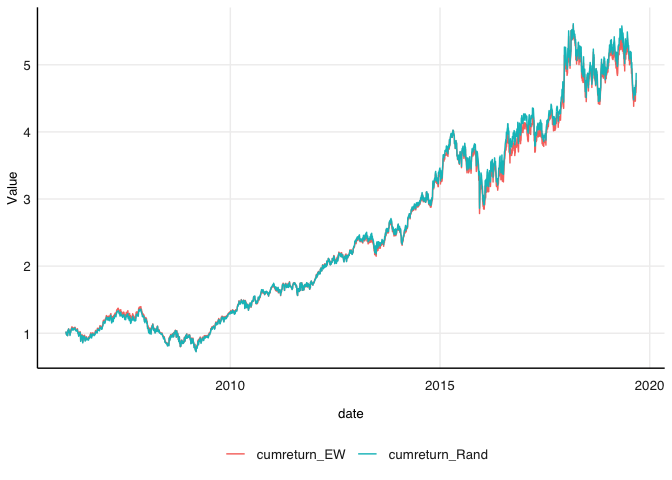
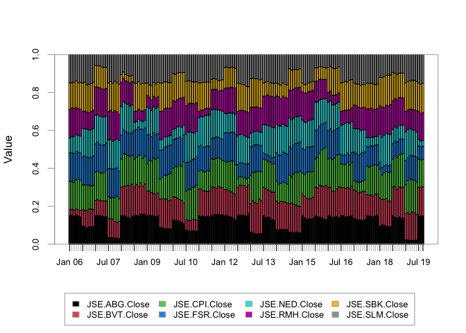
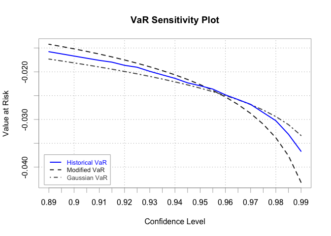
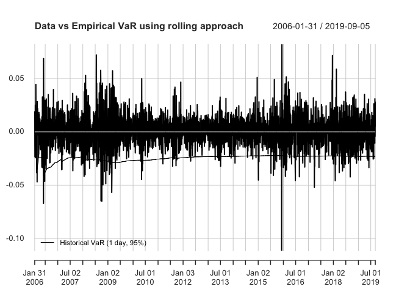

# Purpose

This serves as a notebook for practial two for financial econometrics.
Thus practical covers Portfolio Risk and Performance Analysis. 1)
portfolio construction 2) risk measures

``` r
rm(list = ls()) # Clean your environment:
gc() # garbage collection - It can be useful to call gc after a large object has been removed, as this may prompt R to return memory to the operating system.
```

    ##          used (Mb) gc trigger (Mb) limit (Mb) max used (Mb)
    ## Ncells 464565 24.9     992675 53.1         NA   669305 35.8
    ## Vcells 867752  6.7    8388608 64.0      16384  1840207 14.1

``` r
library(tidyverse)
```

    ## ── Attaching packages ─────────────────────────────────────── tidyverse 1.3.2 ──
    ## ✔ ggplot2 3.4.0     ✔ purrr   1.0.2
    ## ✔ tibble  3.2.1     ✔ dplyr   1.1.2
    ## ✔ tidyr   1.3.0     ✔ stringr 1.5.0
    ## ✔ readr   2.1.4     ✔ forcats 0.5.2
    ## ── Conflicts ────────────────────────────────────────── tidyverse_conflicts() ──
    ## ✖ dplyr::filter() masks stats::filter()
    ## ✖ dplyr::lag()    masks stats::lag()

``` r
list.files('code/', full.names = T, recursive = T) %>% .[grepl('.R', .)] %>% as.list() %>% walk(~source(.))
```

Links to the class and prac

Find video link to last night’s theory class here:
<https://youtu.be/_C2RHJ5S_rc>

Find the link for the practical here: <https://youtu.be/LweAj7tkxYc>

#Data and return calculations

``` r
library(rmsfuns)
pacman::p_load("tidyr", "tbl2xts","devtools","lubridate", "readr", "PerformanceAnalytics", "ggplot2", "dplyr")
dailydata <- fmxdat::findata
```

Let’s remove the NA’s using the nalocf function from practical 2, and
calculate the daily continuous (log) returns using the TTR package’s ROC
call. I introduce this package here as it does not require the data to
be xts, and also provides several other technical wrapper functions that
might prove useful that you can explore.

``` r
pacman::p_load("TTR")
dailydata <- 
dailydata %>% arrange(Date) %>% 
mutate(across(.cols = -Date, .fns = ~TTR::ROC(., type = c("continuous", "discrete")[2]))) %>% 
    # Equivalent to:   # mutate_at(.vars = vars(-Date), ~./lag(.)-1) %>% 
    # continuous equivalent to:   # mutate_at(.vars = vars(-Date), ~(log(.)-log(lag(.)))) 
  mutate_at(.vars = vars(-Date), ~na.locf(., na.rm = F, maxgap = 5)) %>% filter(Date > first(Date))
    # Pad NA's back max 5 days:


# Let's not waste our time - remove spaces in column names!
colnames(dailydata) <- 
  gsub("JSE\\.","",colnames(dailydata))
colnames(dailydata) <- 
  gsub("\\.Close","",colnames(dailydata))

#Use PA package to get a table of statistics
tablestats <-
  dailydata %>% tbl_xts() %>% 
  table.Stats(., ci = 0.95, digits = 3)
print(tablestats[,1:5])
```

    ##                      ABG      BVT      CPI      FSR      NED
    ## Observations    3568.000 3568.000 3568.000 3568.000 3568.000
    ## NAs                0.000    0.000    0.000    0.000    0.000
    ## Minimum           -0.145   -0.096   -0.126   -0.148   -0.105
    ## Quartile 1        -0.010   -0.009   -0.007   -0.010   -0.010
    ## Median             0.000    0.000    0.000    0.000    0.000
    ## Arithmetic Mean    0.000    0.001    0.001    0.001    0.000
    ## Geometric Mean     0.000    0.001    0.001    0.000    0.000
    ## Quartile 3         0.010    0.010    0.010    0.012    0.010
    ## Maximum            0.119    0.105    0.119    0.130    0.126
    ## SE Mean            0.000    0.000    0.000    0.000    0.000
    ## LCL Mean (0.95)    0.000    0.000    0.001    0.000    0.000
    ## UCL Mean (0.95)    0.001    0.001    0.002    0.001    0.001
    ## Variance           0.000    0.000    0.000    0.000    0.000
    ## Stdev              0.019    0.017    0.018    0.020    0.018
    ## Skewness           0.146    0.094    0.009    0.009    0.108
    ## Kurtosis           3.399    2.288    4.997    3.184    2.815

As a side note - look at the incredibly high level of kurtosis (fat
tails) of ABI and ABL (three is parity).

PerformanceAnalytics also offers a means of cleaning the data using
Boudt’s method, which is specifically designed to avoid some of the
cleaning pitfalls as pertaining to portfolio construction and risk
analysis. The technique reduces the magnitude, but not the direction of
observations that exceed a 1−α risk threshold (See Boudt, Peterson &
Croux (2008) for more details)

``` r
pacman::p_load("tbl2xts")
#install:
pacman::p_load("DEoptimR")
pacman::p_load("robustbase")
rtnc <-
data(managers)
Return.clean(managers[,1:4], 
             method = c("none", "boudt", "geltner")[2], alpha = 0.01)
```

    ##               HAM1    HAM2    HAM3    HAM4
    ## 1996-01-31  0.0074      NA  0.0349  0.0222
    ## 1996-02-29  0.0193      NA  0.0351  0.0195
    ## 1996-03-31  0.0155      NA  0.0258 -0.0098
    ## 1996-04-30 -0.0091      NA  0.0449  0.0236
    ## 1996-05-31  0.0076      NA  0.0353  0.0028
    ## 1996-06-30 -0.0039      NA -0.0303 -0.0019
    ## 1996-07-31 -0.0231      NA -0.0337 -0.0446
    ## 1996-08-31  0.0395 -0.0001  0.0461  0.0351
    ## 1996-09-30  0.0147  0.1002  0.0653  0.0757
    ## 1996-10-31  0.0288  0.0338  0.0395 -0.0180
    ##        ...                                
    ## 2006-03-31  0.0397  0.0151  0.0119  0.0107
    ## 2006-04-30 -0.0011  0.0172  0.0031  0.0180
    ## 2006-05-31 -0.0267 -0.0052 -0.0212 -0.0184
    ## 2006-06-30  0.0216 -0.0116 -0.0189  0.0154
    ## 2006-07-31 -0.0144 -0.0131  0.0102 -0.0120
    ## 2006-08-31  0.0161 -0.0113  0.0253 -0.0183
    ## 2006-09-30  0.0068 -0.0231  0.0072  0.0197
    ## 2006-10-31  0.0427  0.0167  0.0183  0.0518
    ## 2006-11-30  0.0117  0.0206  0.0269  0.0373
    ## 2006-12-31  0.0115 -0.0062  0.0110  0.0206

#Portfolio returns Below we will do a proper example of calculating
portfolio returns. We will have a weight vector according to which the
portfolio needs to be rebalanced at periodic dates. We will compare the
performance of a randomly balanced portfolio, and that of an equally
weighted portfolio.

We will then calculate the portfolio values and positions at any given
point in time.

Be very mindful when doing this calculation - note that portfolio
returns change the positions in a portfolio over time, implying that
before each rebalancing, you need to calculate the position in a stock -
and then whether to buy or sell some of the stock to meet the new
weight.

Mathematically, this implies calculating each day what the new portfolio
position is given the stock’s daily return.

``` r
# install.packages("rportfolios")
#cannot install the package as it is no longer on cran but can use 

#install.packages("https://cran.r-project.org/src/contrib/Archive/rportfolios/rportfolios_1.0-1.tar.gz")
library(rportfolios)
```

    ## Loading required package: truncdist

    ## Loading required package: stats4

    ## Loading required package: evd

``` r
dailydata <- fmxdat::findata

dailydata.subset <- 
  
  dailydata %>% 
  
  gather(Stocks, Px, -Date) %>% 
  
  arrange(Date) %>% 
  
  group_by(Stocks) %>% 
  
  mutate(Returns = Px/lag(Px)-1) %>% ungroup() %>% filter(Date > first(Date)) %>% 
  
  select(-Px)

# Let's assume the portfolio rebalances each January and July.

# First, let's save the exact rebalance dates and save the random weight and date information to be used later:
# Below is a very nice way to save months and years: let's rebalance at month 1 and 7... 

RebMonths <- c(1,7) # Make a parameter that can easily be changed later.

RandomWeights <- 
  
dailydata.subset %>% 
  
    mutate(Months = as.numeric(format(Date, format = "%m")), #we need the months for rebalance dates
           
           YearMonths = as.numeric(format(Date, format = "%Y%m"))) %>% 
  
  filter(Months %in% RebMonths) %>% 
  
  group_by(YearMonths, Months, Stocks) %>% filter(Date == last(Date)) %>% ungroup()

# Now let's create a column with the random weights assigned to each stock conforming to the following parameters:
# Let's also create a random weighting vector for our selected stocks, with the following parameters:
# They have to sum to 1...
# Let's add constraints too - you can only have a maximum exposure to a single stock up to 20% of the equal weight.
N_Stocks <- length(unique(RandomWeights$Stocks))

Max_Exposure <-(1/N_Stocks)*1.20

# Minimum exposure is, say, 2%:
Min_Exposure <- 0.02

# Now to append the weight vector, let's use the random.bounded function from rportfolios.

RandomWeights_adj <-  
  bind_cols(RandomWeights %>% arrange(Date),
            RandomWeights %>% group_by(Date) %>% 

  do( Randweights = random.bounded(n = nrow(.),
                 x.t = 1, # Full investment...
                 x.l = rep( Min_Exposure, nrow(.)), # Lower Bound
                 x.u = rep( Max_Exposure, nrow(.)),
                 max.iter = 1000) ) %>% ungroup() %>% unnest(Randweights) %>% select(-Date)
  )

# #lets try to see        
# mutate(RandomWeights = random.bounded(n = nrow(.), 
#                 x.t = 1, # Full investment... 
#                  x.l = rep( Min_Exposure, nrow(.)), # Lower Bound 
#                  x.u = rep( 0.2, nrow(.)), 
#                  max.iter = 1000) ) %>% ungroup() %>% unnest(Randweights) %>%
#     select(-Date)
#   )

# Sanity check: Create a stop function if it doesn't hold...
if( RandomWeights_adj %>% group_by(Date) %>% 
    
    summarise(Fully_Invested = sum(Randweights)) %>% filter(Fully_Invested > 1.000001 | Fully_Invested < 0.9999999 ) %>% nrow() > 0 ) stop("\n=============\n Ooops! \nWeights do not sum to 1... Please check!\n===========\n")

# Create equal weight portfolios as well:
RandomWeights_adj <- 
  
RandomWeights_adj %>% 
  
  group_by(Date) %>% 
  
  mutate(EqualWeights = 1/n()) %>% 
  
  ungroup() %>% select(-Months, -YearMonths)

# Right, so now we have equal and random-weights that we can use at rebalancing dates: January and July.
```

#Creating Portfolios The code below shows how we can create random
portfolios using our returns above, as well as our random and equal
weights.

When doing portfolio return calculations, please use rmsfuns’
Safe\_.Portfolip_Return.Portfolio function rather.

PerformanceAnalytics’ Return.Portfolio function has a few nuances which
might (without error) - give you very wrong results.

I wrote a gist to show why we need to use the safe version for portfolio
return calcs - it also confirms the calculation with a by-hand example.

gist: <https://gist.github.com/Nicktz/a24ba1775d41aab85919c505ca1b9a0c>

Back to our random portfolio calculation;

``` r
pacman::p_load("PerformanceAnalytics")

# Now we use the Safe_Return.portfolio function from PerformanceAnalytics
# Note, as with most PA functions, the inputs are xts and wide...
# Also, let's assume you are investing R1000 at the start:
Fund_Size_at_Start <- 1000

Rand_weights <- 
RandomWeights_adj %>% select(Date, Stocks, Randweights) %>% spread(Stocks, Randweights) %>% tbl_xts() #we want to use PA package so we need it in xts format

EW_weights <- 
RandomWeights_adj %>% select(Date, Stocks, EqualWeights) %>% spread(Stocks, EqualWeights) %>% tbl_xts()

#At rebalance

df_Returns <- 
dailydata.subset %>% spread(Stocks, Returns)

df_Returns[is.na(df_Returns)] <- 0
xts_df_Returns <- df_Returns %>% tbl_xts()
#so now we have all weights and returns in xts
    Rand_RetPort <- 
      rmsfuns::Safe_Return.portfolio(xts_df_Returns, 
                                     
                       weights = Rand_weights, lag_weights = TRUE, #lag weights true means at the same time the weights are changed rather than a delayed change which is the default
                       
                       verbose = TRUE, contribution = TRUE, #If you want more out of the return object then set verbose and contribution to true
                       
                       value = Fund_Size_at_Start, geometric = TRUE) 

    EW_RetPort <- 
      rmsfuns::Safe_Return.portfolio(xts_df_Returns, 
                                     
                       weights = EW_weights, lag_weights = TRUE,
                       
                       verbose = TRUE, contribution = TRUE, 
                       
                       value = Fund_Size_at_Start, geometric = TRUE) 
    
    #Check the layers that the safe returns. because we set verbose and contribution = TRUE
    #xts objects cant use slice so instead have to use head(1)

# Clean and save portfolio returns and weights:
Rand_Contribution <- 
      Rand_RetPort$"contribution" %>% xts_tbl() #All we are doing here is extracting different elements from the object returned from the function above because we kept contribution and verbose = TRUE

Rand_BPWeight <- 
  
      Rand_RetPort$"BOP.Weight" %>% xts_tbl() # BOP means beginning of period 

Rand_BPValue <- 
  
      Rand_RetPort$"BOP.Value" %>% xts_tbl()  
    
# Clean and save portfolio returns and weights:
EW_Contribution <- 
      EW_RetPort$"contribution" %>% xts_tbl() 

EW_BPWeight <- 
      EW_RetPort$"BOP.Weight" %>% xts_tbl()  

EW_BPValue <- 
      EW_RetPort$"BOP.Value" %>% xts_tbl()
    

    names(Rand_Contribution) <- c("date", names(Rand_RetPort$"contribution"))
    names(Rand_BPWeight) <- c("date", names(Rand_RetPort$"BOP.Weight"))
    names(Rand_BPValue) <- c("date", names(Rand_RetPort$"BOP.Value"))
  
    names(EW_Contribution) <- c("date", names(Rand_RetPort$"contribution"))
    names(EW_BPWeight) <- c("date", names(Rand_RetPort$"BOP.Weight"))
    names(EW_BPValue) <- c("date", names(Rand_RetPort$"BOP.Value"))
  
    # Look at what these data.frames each convey - incredible right?
    
    # Let's bind all of these together now:
    
    df_port_return_Random <- 
      left_join(dailydata.subset %>% rename("date" = Date),
                Rand_BPWeight %>% gather(Stocks, weight, -date),
                by = c("date", "Stocks") ) %>% 
      
      left_join(.,
                Rand_BPValue %>% gather(Stocks, value_held, -date),
                by = c("date", "Stocks") ) %>% 
      
      left_join(.,
                Rand_Contribution %>% gather(Stocks, Contribution, -date),
                by = c("date", "Stocks"))

    df_port_return_EW <- 
      left_join(dailydata.subset %>% rename("date" = Date),
                EW_BPWeight %>% gather(Stocks, weight, -date),
                by = c("date", "Stocks") ) %>% 
      
      left_join(.,
                EW_BPValue %>% gather(Stocks, value_held, -date),
                by = c("date", "Stocks") ) %>% 
      
      left_join(.,
                EW_Contribution %>% gather(Stocks, Contribution, -date),
                by = c("date", "Stocks"))

# Calculate Portfolio Returns:
df_Portf_Random <- 
    df_port_return_Random %>% group_by(date) %>% summarise(PortfolioReturn = sum(Returns*weight, na.rm =TRUE)) %>% 
      filter(PortfolioReturn != 0)
      
# Calculate Portfolio Returns:
df_Portf_EW <- 
    df_port_return_EW %>% group_by(date) %>% summarise(PortfolioReturn = sum(Returns*weight, na.rm =TRUE)) %>% 
      filter(PortfolioReturn != 0)

#THIS IS the same as the raw returns, this is giving the monthly returns for the entire portfolio
#remember the difference between simple and log and therefore can transform or chaining, nico says that chaining is his preference
```

$$
r\_{t,P} = ln(1+R\_{t,P}) =ln \left(  1+\sum_i^n\omega_iR\_{i,t} \right) \neq \sum_i^n\omega_iR\_{i,t}
$$
Thus, the following should be remembered:

Simple returns provide convenience in summing across assets for a given
date.

log returns provide convenience in summing across .

Luckily, it is easy to move between simple and compounded returns
mathematically.

By definition, simple and log returns can be written interchangeably as:

From Simple → log returns: R=exp(r)−1

From log → Simple returns: r=ln(R+1)

Using the above definition, and also the convenience of summing simple
returns to get weighted returns, we need to:

rewrite the log to simple returns (if you started with log returns)

sum the weighted simple returns to get the weighted portfolio returns
(see eq ??? ).

write it back into log return form again (if needed). Also, if geometric
= FALSE, it uses a simple arithmetic chain (sum returns), which is what
we want to use now. If geometric =TRUE, it uses a product approach
useful for calculating wealth indexes.

#Portfolio cumulative returns Calculating the value of your investment
over time requires geometrically chaining our simple returns. Luckily,
this is pretty easy:

``` r
#If i had an initial investment in the portfolio how much would i have at a certain time?
Cum_Rand <- 
df_Portf_Random %>%
    mutate(cumreturn_Rand = (cumprod(1 + PortfolioReturn))) %>% 
  # Start at 1
  mutate(cumreturn_Rand = cumreturn_Rand / first(cumreturn_Rand)) %>% select(-PortfolioReturn) # this just makes the return start at 1

Cum_EW <- 
df_Portf_EW %>% 
    mutate(cumreturn_EW = (cumprod(1 + PortfolioReturn))) %>% 
    mutate(cumreturn_EW = cumreturn_EW / first(cumreturn_EW)) %>% select(-PortfolioReturn)

Cum_Comp <- 
  left_join(Cum_Rand, Cum_EW, by = "date") %>% gather(Type, Value, -date)

# Now let's plot the wealth index (if you invested R100 in each) of the two portfolios::

Cum_Comp %>% 
  group_by(Type) %>% 
  ggplot() + geom_line( aes(date, Value, color = Type) ) + 
  fmxdat::theme_fmx()
```

    ## Warning in loadfonts_win(quiet = quiet): OS is not Windows. No fonts registered
    ## with windowsFonts().



Weights plot

``` r
# StackBar of monthly weights (Note the stand-out rebalance weights...):
Rand_BPWeight %>% tbl_xts() %>% .[endpoints(.,'months')] %>% chart.StackedBar()
```



#Portfolio Risk Analasys \## Calendar Performance

``` r
pacman::p_load("knitr", "gt")
# EW Portfolio
t <-
  table.CalendarReturns(df_Portf_Random %>% tbl_xts(), digits = 1, geometric = TRUE)
Cols_length <- ncol(t)

t %>% 
    tibble::rownames_to_column() %>% 
    rename(year = rowname) %>% 

gt(rowname_col = "year") %>% 
      tab_header(title = glue::glue("Portfolio Calendar Returns: Random")) %>% 
      fmt_percent(
      columns = 1:Cols_length,
      decimals = 1
    )
```

<div id="uzpuqwkzac" style="padding-left:0px;padding-right:0px;padding-top:10px;padding-bottom:10px;overflow-x:auto;overflow-y:auto;width:auto;height:auto;">
<style>#uzpuqwkzac table {
  font-family: system-ui, 'Segoe UI', Roboto, Helvetica, Arial, sans-serif, 'Apple Color Emoji', 'Segoe UI Emoji', 'Segoe UI Symbol', 'Noto Color Emoji';
  -webkit-font-smoothing: antialiased;
  -moz-osx-font-smoothing: grayscale;
}

#uzpuqwkzac thead, #uzpuqwkzac tbody, #uzpuqwkzac tfoot, #uzpuqwkzac tr, #uzpuqwkzac td, #uzpuqwkzac th {
  border-style: none;
}

#uzpuqwkzac p {
  margin: 0;
  padding: 0;
}

#uzpuqwkzac .gt_table {
  display: table;
  border-collapse: collapse;
  line-height: normal;
  margin-left: auto;
  margin-right: auto;
  color: #333333;
  font-size: 16px;
  font-weight: normal;
  font-style: normal;
  background-color: #FFFFFF;
  width: auto;
  border-top-style: solid;
  border-top-width: 2px;
  border-top-color: #A8A8A8;
  border-right-style: none;
  border-right-width: 2px;
  border-right-color: #D3D3D3;
  border-bottom-style: solid;
  border-bottom-width: 2px;
  border-bottom-color: #A8A8A8;
  border-left-style: none;
  border-left-width: 2px;
  border-left-color: #D3D3D3;
}

#uzpuqwkzac .gt_caption {
  padding-top: 4px;
  padding-bottom: 4px;
}

#uzpuqwkzac .gt_title {
  color: #333333;
  font-size: 125%;
  font-weight: initial;
  padding-top: 4px;
  padding-bottom: 4px;
  padding-left: 5px;
  padding-right: 5px;
  border-bottom-color: #FFFFFF;
  border-bottom-width: 0;
}

#uzpuqwkzac .gt_subtitle {
  color: #333333;
  font-size: 85%;
  font-weight: initial;
  padding-top: 3px;
  padding-bottom: 5px;
  padding-left: 5px;
  padding-right: 5px;
  border-top-color: #FFFFFF;
  border-top-width: 0;
}

#uzpuqwkzac .gt_heading {
  background-color: #FFFFFF;
  text-align: center;
  border-bottom-color: #FFFFFF;
  border-left-style: none;
  border-left-width: 1px;
  border-left-color: #D3D3D3;
  border-right-style: none;
  border-right-width: 1px;
  border-right-color: #D3D3D3;
}

#uzpuqwkzac .gt_bottom_border {
  border-bottom-style: solid;
  border-bottom-width: 2px;
  border-bottom-color: #D3D3D3;
}

#uzpuqwkzac .gt_col_headings {
  border-top-style: solid;
  border-top-width: 2px;
  border-top-color: #D3D3D3;
  border-bottom-style: solid;
  border-bottom-width: 2px;
  border-bottom-color: #D3D3D3;
  border-left-style: none;
  border-left-width: 1px;
  border-left-color: #D3D3D3;
  border-right-style: none;
  border-right-width: 1px;
  border-right-color: #D3D3D3;
}

#uzpuqwkzac .gt_col_heading {
  color: #333333;
  background-color: #FFFFFF;
  font-size: 100%;
  font-weight: normal;
  text-transform: inherit;
  border-left-style: none;
  border-left-width: 1px;
  border-left-color: #D3D3D3;
  border-right-style: none;
  border-right-width: 1px;
  border-right-color: #D3D3D3;
  vertical-align: bottom;
  padding-top: 5px;
  padding-bottom: 6px;
  padding-left: 5px;
  padding-right: 5px;
  overflow-x: hidden;
}

#uzpuqwkzac .gt_column_spanner_outer {
  color: #333333;
  background-color: #FFFFFF;
  font-size: 100%;
  font-weight: normal;
  text-transform: inherit;
  padding-top: 0;
  padding-bottom: 0;
  padding-left: 4px;
  padding-right: 4px;
}

#uzpuqwkzac .gt_column_spanner_outer:first-child {
  padding-left: 0;
}

#uzpuqwkzac .gt_column_spanner_outer:last-child {
  padding-right: 0;
}

#uzpuqwkzac .gt_column_spanner {
  border-bottom-style: solid;
  border-bottom-width: 2px;
  border-bottom-color: #D3D3D3;
  vertical-align: bottom;
  padding-top: 5px;
  padding-bottom: 5px;
  overflow-x: hidden;
  display: inline-block;
  width: 100%;
}

#uzpuqwkzac .gt_spanner_row {
  border-bottom-style: hidden;
}

#uzpuqwkzac .gt_group_heading {
  padding-top: 8px;
  padding-bottom: 8px;
  padding-left: 5px;
  padding-right: 5px;
  color: #333333;
  background-color: #FFFFFF;
  font-size: 100%;
  font-weight: initial;
  text-transform: inherit;
  border-top-style: solid;
  border-top-width: 2px;
  border-top-color: #D3D3D3;
  border-bottom-style: solid;
  border-bottom-width: 2px;
  border-bottom-color: #D3D3D3;
  border-left-style: none;
  border-left-width: 1px;
  border-left-color: #D3D3D3;
  border-right-style: none;
  border-right-width: 1px;
  border-right-color: #D3D3D3;
  vertical-align: middle;
  text-align: left;
}

#uzpuqwkzac .gt_empty_group_heading {
  padding: 0.5px;
  color: #333333;
  background-color: #FFFFFF;
  font-size: 100%;
  font-weight: initial;
  border-top-style: solid;
  border-top-width: 2px;
  border-top-color: #D3D3D3;
  border-bottom-style: solid;
  border-bottom-width: 2px;
  border-bottom-color: #D3D3D3;
  vertical-align: middle;
}

#uzpuqwkzac .gt_from_md > :first-child {
  margin-top: 0;
}

#uzpuqwkzac .gt_from_md > :last-child {
  margin-bottom: 0;
}

#uzpuqwkzac .gt_row {
  padding-top: 8px;
  padding-bottom: 8px;
  padding-left: 5px;
  padding-right: 5px;
  margin: 10px;
  border-top-style: solid;
  border-top-width: 1px;
  border-top-color: #D3D3D3;
  border-left-style: none;
  border-left-width: 1px;
  border-left-color: #D3D3D3;
  border-right-style: none;
  border-right-width: 1px;
  border-right-color: #D3D3D3;
  vertical-align: middle;
  overflow-x: hidden;
}

#uzpuqwkzac .gt_stub {
  color: #333333;
  background-color: #FFFFFF;
  font-size: 100%;
  font-weight: initial;
  text-transform: inherit;
  border-right-style: solid;
  border-right-width: 2px;
  border-right-color: #D3D3D3;
  padding-left: 5px;
  padding-right: 5px;
}

#uzpuqwkzac .gt_stub_row_group {
  color: #333333;
  background-color: #FFFFFF;
  font-size: 100%;
  font-weight: initial;
  text-transform: inherit;
  border-right-style: solid;
  border-right-width: 2px;
  border-right-color: #D3D3D3;
  padding-left: 5px;
  padding-right: 5px;
  vertical-align: top;
}

#uzpuqwkzac .gt_row_group_first td {
  border-top-width: 2px;
}

#uzpuqwkzac .gt_row_group_first th {
  border-top-width: 2px;
}

#uzpuqwkzac .gt_summary_row {
  color: #333333;
  background-color: #FFFFFF;
  text-transform: inherit;
  padding-top: 8px;
  padding-bottom: 8px;
  padding-left: 5px;
  padding-right: 5px;
}

#uzpuqwkzac .gt_first_summary_row {
  border-top-style: solid;
  border-top-color: #D3D3D3;
}

#uzpuqwkzac .gt_first_summary_row.thick {
  border-top-width: 2px;
}

#uzpuqwkzac .gt_last_summary_row {
  padding-top: 8px;
  padding-bottom: 8px;
  padding-left: 5px;
  padding-right: 5px;
  border-bottom-style: solid;
  border-bottom-width: 2px;
  border-bottom-color: #D3D3D3;
}

#uzpuqwkzac .gt_grand_summary_row {
  color: #333333;
  background-color: #FFFFFF;
  text-transform: inherit;
  padding-top: 8px;
  padding-bottom: 8px;
  padding-left: 5px;
  padding-right: 5px;
}

#uzpuqwkzac .gt_first_grand_summary_row {
  padding-top: 8px;
  padding-bottom: 8px;
  padding-left: 5px;
  padding-right: 5px;
  border-top-style: double;
  border-top-width: 6px;
  border-top-color: #D3D3D3;
}

#uzpuqwkzac .gt_last_grand_summary_row_top {
  padding-top: 8px;
  padding-bottom: 8px;
  padding-left: 5px;
  padding-right: 5px;
  border-bottom-style: double;
  border-bottom-width: 6px;
  border-bottom-color: #D3D3D3;
}

#uzpuqwkzac .gt_striped {
  background-color: rgba(128, 128, 128, 0.05);
}

#uzpuqwkzac .gt_table_body {
  border-top-style: solid;
  border-top-width: 2px;
  border-top-color: #D3D3D3;
  border-bottom-style: solid;
  border-bottom-width: 2px;
  border-bottom-color: #D3D3D3;
}

#uzpuqwkzac .gt_footnotes {
  color: #333333;
  background-color: #FFFFFF;
  border-bottom-style: none;
  border-bottom-width: 2px;
  border-bottom-color: #D3D3D3;
  border-left-style: none;
  border-left-width: 2px;
  border-left-color: #D3D3D3;
  border-right-style: none;
  border-right-width: 2px;
  border-right-color: #D3D3D3;
}

#uzpuqwkzac .gt_footnote {
  margin: 0px;
  font-size: 90%;
  padding-top: 4px;
  padding-bottom: 4px;
  padding-left: 5px;
  padding-right: 5px;
}

#uzpuqwkzac .gt_sourcenotes {
  color: #333333;
  background-color: #FFFFFF;
  border-bottom-style: none;
  border-bottom-width: 2px;
  border-bottom-color: #D3D3D3;
  border-left-style: none;
  border-left-width: 2px;
  border-left-color: #D3D3D3;
  border-right-style: none;
  border-right-width: 2px;
  border-right-color: #D3D3D3;
}

#uzpuqwkzac .gt_sourcenote {
  font-size: 90%;
  padding-top: 4px;
  padding-bottom: 4px;
  padding-left: 5px;
  padding-right: 5px;
}

#uzpuqwkzac .gt_left {
  text-align: left;
}

#uzpuqwkzac .gt_center {
  text-align: center;
}

#uzpuqwkzac .gt_right {
  text-align: right;
  font-variant-numeric: tabular-nums;
}

#uzpuqwkzac .gt_font_normal {
  font-weight: normal;
}

#uzpuqwkzac .gt_font_bold {
  font-weight: bold;
}

#uzpuqwkzac .gt_font_italic {
  font-style: italic;
}

#uzpuqwkzac .gt_super {
  font-size: 65%;
}

#uzpuqwkzac .gt_footnote_marks {
  font-size: 75%;
  vertical-align: 0.4em;
  position: initial;
}

#uzpuqwkzac .gt_asterisk {
  font-size: 100%;
  vertical-align: 0;
}

#uzpuqwkzac .gt_indent_1 {
  text-indent: 5px;
}

#uzpuqwkzac .gt_indent_2 {
  text-indent: 10px;
}

#uzpuqwkzac .gt_indent_3 {
  text-indent: 15px;
}

#uzpuqwkzac .gt_indent_4 {
  text-indent: 20px;
}

#uzpuqwkzac .gt_indent_5 {
  text-indent: 25px;
}
</style>
<table class="gt_table" data-quarto-disable-processing="false" data-quarto-bootstrap="false">
  <thead>
    <tr class="gt_heading">
      <td colspan="14" class="gt_heading gt_title gt_font_normal gt_bottom_border" style>Portfolio Calendar Returns: Random</td>
    </tr>
    
    <tr class="gt_col_headings">
      <th class="gt_col_heading gt_columns_bottom_border gt_left" rowspan="1" colspan="1" scope="col" id=""></th>
      <th class="gt_col_heading gt_columns_bottom_border gt_right" rowspan="1" colspan="1" scope="col" id="Jan">Jan</th>
      <th class="gt_col_heading gt_columns_bottom_border gt_right" rowspan="1" colspan="1" scope="col" id="Feb">Feb</th>
      <th class="gt_col_heading gt_columns_bottom_border gt_right" rowspan="1" colspan="1" scope="col" id="Mar">Mar</th>
      <th class="gt_col_heading gt_columns_bottom_border gt_right" rowspan="1" colspan="1" scope="col" id="Apr">Apr</th>
      <th class="gt_col_heading gt_columns_bottom_border gt_right" rowspan="1" colspan="1" scope="col" id="May">May</th>
      <th class="gt_col_heading gt_columns_bottom_border gt_right" rowspan="1" colspan="1" scope="col" id="Jun">Jun</th>
      <th class="gt_col_heading gt_columns_bottom_border gt_right" rowspan="1" colspan="1" scope="col" id="Jul">Jul</th>
      <th class="gt_col_heading gt_columns_bottom_border gt_right" rowspan="1" colspan="1" scope="col" id="Aug">Aug</th>
      <th class="gt_col_heading gt_columns_bottom_border gt_right" rowspan="1" colspan="1" scope="col" id="Sep">Sep</th>
      <th class="gt_col_heading gt_columns_bottom_border gt_right" rowspan="1" colspan="1" scope="col" id="Oct">Oct</th>
      <th class="gt_col_heading gt_columns_bottom_border gt_right" rowspan="1" colspan="1" scope="col" id="Nov">Nov</th>
      <th class="gt_col_heading gt_columns_bottom_border gt_right" rowspan="1" colspan="1" scope="col" id="Dec">Dec</th>
      <th class="gt_col_heading gt_columns_bottom_border gt_right" rowspan="1" colspan="1" scope="col" id="PortfolioReturn">PortfolioReturn</th>
    </tr>
  </thead>
  <tbody class="gt_table_body">
    <tr><th id="stub_1_1" scope="row" class="gt_row gt_right gt_stub">2006</th>
<td headers="stub_1_1 Jan" class="gt_row gt_right">130.0%</td>
<td headers="stub_1_1 Feb" class="gt_row gt_right">−380.0%</td>
<td headers="stub_1_1 Mar" class="gt_row gt_right">−210.0%</td>
<td headers="stub_1_1 Apr" class="gt_row gt_right">50.0%</td>
<td headers="stub_1_1 May" class="gt_row gt_right">−30.0%</td>
<td headers="stub_1_1 Jun" class="gt_row gt_right">200.0%</td>
<td headers="stub_1_1 Jul" class="gt_row gt_right">80.0%</td>
<td headers="stub_1_1 Aug" class="gt_row gt_right">−70.0%</td>
<td headers="stub_1_1 Sep" class="gt_row gt_right">−30.0%</td>
<td headers="stub_1_1 Oct" class="gt_row gt_right">400.0%</td>
<td headers="stub_1_1 Nov" class="gt_row gt_right">−70.0%</td>
<td headers="stub_1_1 Dec" class="gt_row gt_right">0.0%</td>
<td headers="stub_1_1 PortfolioReturn" class="gt_row gt_right">0.3</td></tr>
    <tr><th id="stub_1_2" scope="row" class="gt_row gt_right gt_stub">2007</th>
<td headers="stub_1_2 Jan" class="gt_row gt_right">−60.0%</td>
<td headers="stub_1_2 Feb" class="gt_row gt_right">0.0%</td>
<td headers="stub_1_2 Mar" class="gt_row gt_right">110.0%</td>
<td headers="stub_1_2 Apr" class="gt_row gt_right">60.0%</td>
<td headers="stub_1_2 May" class="gt_row gt_right">10.0%</td>
<td headers="stub_1_2 Jun" class="gt_row gt_right">−20.0%</td>
<td headers="stub_1_2 Jul" class="gt_row gt_right">70.0%</td>
<td headers="stub_1_2 Aug" class="gt_row gt_right">210.0%</td>
<td headers="stub_1_2 Sep" class="gt_row gt_right">−20.0%</td>
<td headers="stub_1_2 Oct" class="gt_row gt_right">−80.0%</td>
<td headers="stub_1_2 Nov" class="gt_row gt_right">−80.0%</td>
<td headers="stub_1_2 Dec" class="gt_row gt_right">−300.0%</td>
<td headers="stub_1_2 PortfolioReturn" class="gt_row gt_right">-1.1</td></tr>
    <tr><th id="stub_1_3" scope="row" class="gt_row gt_right gt_stub">2008</th>
<td headers="stub_1_3 Jan" class="gt_row gt_right">−140.0%</td>
<td headers="stub_1_3 Feb" class="gt_row gt_right">−40.0%</td>
<td headers="stub_1_3 Mar" class="gt_row gt_right">−170.0%</td>
<td headers="stub_1_3 Apr" class="gt_row gt_right">30.0%</td>
<td headers="stub_1_3 May" class="gt_row gt_right">90.0%</td>
<td headers="stub_1_3 Jun" class="gt_row gt_right">−140.0%</td>
<td headers="stub_1_3 Jul" class="gt_row gt_right">60.0%</td>
<td headers="stub_1_3 Aug" class="gt_row gt_right">−140.0%</td>
<td headers="stub_1_3 Sep" class="gt_row gt_right">430.0%</td>
<td headers="stub_1_3 Oct" class="gt_row gt_right">120.0%</td>
<td headers="stub_1_3 Nov" class="gt_row gt_right">20.0%</td>
<td headers="stub_1_3 Dec" class="gt_row gt_right">30.0%</td>
<td headers="stub_1_3 PortfolioReturn" class="gt_row gt_right">1.2</td></tr>
    <tr><th id="stub_1_4" scope="row" class="gt_row gt_right gt_stub">2009</th>
<td headers="stub_1_4 Jan" class="gt_row gt_right">−220.0%</td>
<td headers="stub_1_4 Feb" class="gt_row gt_right">−570.0%</td>
<td headers="stub_1_4 Mar" class="gt_row gt_right">300.0%</td>
<td headers="stub_1_4 Apr" class="gt_row gt_right">−30.0%</td>
<td headers="stub_1_4 May" class="gt_row gt_right">30.0%</td>
<td headers="stub_1_4 Jun" class="gt_row gt_right">30.0%</td>
<td headers="stub_1_4 Jul" class="gt_row gt_right">40.0%</td>
<td headers="stub_1_4 Aug" class="gt_row gt_right">0.0%</td>
<td headers="stub_1_4 Sep" class="gt_row gt_right">50.0%</td>
<td headers="stub_1_4 Oct" class="gt_row gt_right">−100.0%</td>
<td headers="stub_1_4 Nov" class="gt_row gt_right">100.0%</td>
<td headers="stub_1_4 Dec" class="gt_row gt_right">150.0%</td>
<td headers="stub_1_4 PortfolioReturn" class="gt_row gt_right">-2.3</td></tr>
    <tr><th id="stub_1_5" scope="row" class="gt_row gt_right gt_stub">2010</th>
<td headers="stub_1_5 Jan" class="gt_row gt_right">50.0%</td>
<td headers="stub_1_5 Feb" class="gt_row gt_right">70.0%</td>
<td headers="stub_1_5 Mar" class="gt_row gt_right">120.0%</td>
<td headers="stub_1_5 Apr" class="gt_row gt_right">40.0%</td>
<td headers="stub_1_5 May" class="gt_row gt_right">−80.0%</td>
<td headers="stub_1_5 Jun" class="gt_row gt_right">−220.0%</td>
<td headers="stub_1_5 Jul" class="gt_row gt_right">−70.0%</td>
<td headers="stub_1_5 Aug" class="gt_row gt_right">90.0%</td>
<td headers="stub_1_5 Sep" class="gt_row gt_right">130.0%</td>
<td headers="stub_1_5 Oct" class="gt_row gt_right">0.0%</td>
<td headers="stub_1_5 Nov" class="gt_row gt_right">−140.0%</td>
<td headers="stub_1_5 Dec" class="gt_row gt_right">10.0%</td>
<td headers="stub_1_5 PortfolioReturn" class="gt_row gt_right">0.1</td></tr>
    <tr><th id="stub_1_6" scope="row" class="gt_row gt_right gt_stub">2011</th>
<td headers="stub_1_6 Jan" class="gt_row gt_right">−90.0%</td>
<td headers="stub_1_6 Feb" class="gt_row gt_right">−20.0%</td>
<td headers="stub_1_6 Mar" class="gt_row gt_right">−10.0%</td>
<td headers="stub_1_6 Apr" class="gt_row gt_right">70.0%</td>
<td headers="stub_1_6 May" class="gt_row gt_right">110.0%</td>
<td headers="stub_1_6 Jun" class="gt_row gt_right">20.0%</td>
<td headers="stub_1_6 Jul" class="gt_row gt_right">−60.0%</td>
<td headers="stub_1_6 Aug" class="gt_row gt_right">290.0%</td>
<td headers="stub_1_6 Sep" class="gt_row gt_right">170.0%</td>
<td headers="stub_1_6 Oct" class="gt_row gt_right">−110.0%</td>
<td headers="stub_1_6 Nov" class="gt_row gt_right">470.0%</td>
<td headers="stub_1_6 Dec" class="gt_row gt_right">−40.0%</td>
<td headers="stub_1_6 PortfolioReturn" class="gt_row gt_right">8.1</td></tr>
    <tr><th id="stub_1_7" scope="row" class="gt_row gt_right gt_stub">2012</th>
<td headers="stub_1_7 Jan" class="gt_row gt_right">30.0%</td>
<td headers="stub_1_7 Feb" class="gt_row gt_right">0.0%</td>
<td headers="stub_1_7 Mar" class="gt_row gt_right">−20.0%</td>
<td headers="stub_1_7 Apr" class="gt_row gt_right">100.0%</td>
<td headers="stub_1_7 May" class="gt_row gt_right">80.0%</td>
<td headers="stub_1_7 Jun" class="gt_row gt_right">110.0%</td>
<td headers="stub_1_7 Jul" class="gt_row gt_right">−180.0%</td>
<td headers="stub_1_7 Aug" class="gt_row gt_right">60.0%</td>
<td headers="stub_1_7 Sep" class="gt_row gt_right">60.0%</td>
<td headers="stub_1_7 Oct" class="gt_row gt_right">−80.0%</td>
<td headers="stub_1_7 Nov" class="gt_row gt_right">20.0%</td>
<td headers="stub_1_7 Dec" class="gt_row gt_right">−80.0%</td>
<td headers="stub_1_7 PortfolioReturn" class="gt_row gt_right">0.9</td></tr>
    <tr><th id="stub_1_8" scope="row" class="gt_row gt_right gt_stub">2013</th>
<td headers="stub_1_8 Jan" class="gt_row gt_right">−120.0%</td>
<td headers="stub_1_8 Feb" class="gt_row gt_right">150.0%</td>
<td headers="stub_1_8 Mar" class="gt_row gt_right">40.0%</td>
<td headers="stub_1_8 Apr" class="gt_row gt_right">90.0%</td>
<td headers="stub_1_8 May" class="gt_row gt_right">10.0%</td>
<td headers="stub_1_8 Jun" class="gt_row gt_right">170.0%</td>
<td headers="stub_1_8 Jul" class="gt_row gt_right">130.0%</td>
<td headers="stub_1_8 Aug" class="gt_row gt_right">50.0%</td>
<td headers="stub_1_8 Sep" class="gt_row gt_right">−100.0%</td>
<td headers="stub_1_8 Oct" class="gt_row gt_right">30.0%</td>
<td headers="stub_1_8 Nov" class="gt_row gt_right">10.0%</td>
<td headers="stub_1_8 Dec" class="gt_row gt_right">−10.0%</td>
<td headers="stub_1_8 PortfolioReturn" class="gt_row gt_right">4.6</td></tr>
    <tr><th id="stub_1_9" scope="row" class="gt_row gt_right gt_stub">2014</th>
<td headers="stub_1_9 Jan" class="gt_row gt_right">100.0%</td>
<td headers="stub_1_9 Feb" class="gt_row gt_right">90.0%</td>
<td headers="stub_1_9 Mar" class="gt_row gt_right">−20.0%</td>
<td headers="stub_1_9 Apr" class="gt_row gt_right">−20.0%</td>
<td headers="stub_1_9 May" class="gt_row gt_right">−50.0%</td>
<td headers="stub_1_9 Jun" class="gt_row gt_right">70.0%</td>
<td headers="stub_1_9 Jul" class="gt_row gt_right">30.0%</td>
<td headers="stub_1_9 Aug" class="gt_row gt_right">−110.0%</td>
<td headers="stub_1_9 Sep" class="gt_row gt_right">10.0%</td>
<td headers="stub_1_9 Oct" class="gt_row gt_right">270.0%</td>
<td headers="stub_1_9 Nov" class="gt_row gt_right">−60.0%</td>
<td headers="stub_1_9 Dec" class="gt_row gt_right">90.0%</td>
<td headers="stub_1_9 PortfolioReturn" class="gt_row gt_right">3.9</td></tr>
    <tr><th id="stub_1_10" scope="row" class="gt_row gt_right gt_stub">2015</th>
<td headers="stub_1_10 Jan" class="gt_row gt_right">100.0%</td>
<td headers="stub_1_10 Feb" class="gt_row gt_right">−150.0%</td>
<td headers="stub_1_10 Mar" class="gt_row gt_right">60.0%</td>
<td headers="stub_1_10 Apr" class="gt_row gt_right">40.0%</td>
<td headers="stub_1_10 May" class="gt_row gt_right">−150.0%</td>
<td headers="stub_1_10 Jun" class="gt_row gt_right">120.0%</td>
<td headers="stub_1_10 Jul" class="gt_row gt_right">100.0%</td>
<td headers="stub_1_10 Aug" class="gt_row gt_right">50.0%</td>
<td headers="stub_1_10 Sep" class="gt_row gt_right">130.0%</td>
<td headers="stub_1_10 Oct" class="gt_row gt_right">60.0%</td>
<td headers="stub_1_10 Nov" class="gt_row gt_right">−150.0%</td>
<td headers="stub_1_10 Dec" class="gt_row gt_right">−80.0%</td>
<td headers="stub_1_10 PortfolioReturn" class="gt_row gt_right">1.4</td></tr>
    <tr><th id="stub_1_11" scope="row" class="gt_row gt_right gt_stub">2016</th>
<td headers="stub_1_11 Jan" class="gt_row gt_right">450.0%</td>
<td headers="stub_1_11 Feb" class="gt_row gt_right">−200.0%</td>
<td headers="stub_1_11 Mar" class="gt_row gt_right">120.0%</td>
<td headers="stub_1_11 Apr" class="gt_row gt_right">−200.0%</td>
<td headers="stub_1_11 May" class="gt_row gt_right">10.0%</td>
<td headers="stub_1_11 Jun" class="gt_row gt_right">170.0%</td>
<td headers="stub_1_11 Jul" class="gt_row gt_right">40.0%</td>
<td headers="stub_1_11 Aug" class="gt_row gt_right">−170.0%</td>
<td headers="stub_1_11 Sep" class="gt_row gt_right">−170.0%</td>
<td headers="stub_1_11 Oct" class="gt_row gt_right">220.0%</td>
<td headers="stub_1_11 Nov" class="gt_row gt_right">−120.0%</td>
<td headers="stub_1_11 Dec" class="gt_row gt_right">−70.0%</td>
<td headers="stub_1_11 PortfolioReturn" class="gt_row gt_right">0.6</td></tr>
    <tr><th id="stub_1_12" scope="row" class="gt_row gt_right gt_stub">2017</th>
<td headers="stub_1_12 Jan" class="gt_row gt_right">30.0%</td>
<td headers="stub_1_12 Feb" class="gt_row gt_right">−140.0%</td>
<td headers="stub_1_12 Mar" class="gt_row gt_right">−520.0%</td>
<td headers="stub_1_12 Apr" class="gt_row gt_right">−10.0%</td>
<td headers="stub_1_12 May" class="gt_row gt_right">−210.0%</td>
<td headers="stub_1_12 Jun" class="gt_row gt_right">20.0%</td>
<td headers="stub_1_12 Jul" class="gt_row gt_right">−50.0%</td>
<td headers="stub_1_12 Aug" class="gt_row gt_right">30.0%</td>
<td headers="stub_1_12 Sep" class="gt_row gt_right">70.0%</td>
<td headers="stub_1_12 Oct" class="gt_row gt_right">−40.0%</td>
<td headers="stub_1_12 Nov" class="gt_row gt_right">−60.0%</td>
<td headers="stub_1_12 Dec" class="gt_row gt_right">210.0%</td>
<td headers="stub_1_12 PortfolioReturn" class="gt_row gt_right">-6.9</td></tr>
    <tr><th id="stub_1_13" scope="row" class="gt_row gt_right gt_stub">2018</th>
<td headers="stub_1_13 Jan" class="gt_row gt_right">40.0%</td>
<td headers="stub_1_13 Feb" class="gt_row gt_right">−220.0%</td>
<td headers="stub_1_13 Mar" class="gt_row gt_right">180.0%</td>
<td headers="stub_1_13 Apr" class="gt_row gt_right">250.0%</td>
<td headers="stub_1_13 May" class="gt_row gt_right">110.0%</td>
<td headers="stub_1_13 Jun" class="gt_row gt_right">370.0%</td>
<td headers="stub_1_13 Jul" class="gt_row gt_right">120.0%</td>
<td headers="stub_1_13 Aug" class="gt_row gt_right">140.0%</td>
<td headers="stub_1_13 Sep" class="gt_row gt_right">−100.0%</td>
<td headers="stub_1_13 Oct" class="gt_row gt_right">10.0%</td>
<td headers="stub_1_13 Nov" class="gt_row gt_right">−260.0%</td>
<td headers="stub_1_13 Dec" class="gt_row gt_right">70.0%</td>
<td headers="stub_1_13 PortfolioReturn" class="gt_row gt_right">7.2</td></tr>
    <tr><th id="stub_1_14" scope="row" class="gt_row gt_right gt_stub">2019</th>
<td headers="stub_1_14 Jan" class="gt_row gt_right">110.0%</td>
<td headers="stub_1_14 Feb" class="gt_row gt_right">−30.0%</td>
<td headers="stub_1_14 Mar" class="gt_row gt_right">170.0%</td>
<td headers="stub_1_14 Apr" class="gt_row gt_right">10.0%</td>
<td headers="stub_1_14 May" class="gt_row gt_right">60.0%</td>
<td headers="stub_1_14 Jun" class="gt_row gt_right">−50.0%</td>
<td headers="stub_1_14 Jul" class="gt_row gt_right">−130.0%</td>
<td headers="stub_1_14 Aug" class="gt_row gt_right">310.0%</td>
<td headers="stub_1_14 Sep" class="gt_row gt_right">280.0%</td>
<td headers="stub_1_14 Oct" class="gt_row gt_right">NA</td>
<td headers="stub_1_14 Nov" class="gt_row gt_right">NA</td>
<td headers="stub_1_14 Dec" class="gt_row gt_right">NA</td>
<td headers="stub_1_14 PortfolioReturn" class="gt_row gt_right">7.5</td></tr>
  </tbody>
  
  
</table>
</div>

``` r
# Random Portfolio
t2 <- 
  table.CalendarReturns(df_Portf_EW %>% tbl_xts(), digits = 1, geometric = TRUE)
gt(t2/100) %>% 
      tab_header(title = glue::glue("Portfolio Calendar Returns: EW")) %>% 
      fmt_percent(
      columns = 1:Cols_length,
      decimals = 1
    )
```

<div id="pgdiofbjqn" style="padding-left:0px;padding-right:0px;padding-top:10px;padding-bottom:10px;overflow-x:auto;overflow-y:auto;width:auto;height:auto;">
<style>#pgdiofbjqn table {
  font-family: system-ui, 'Segoe UI', Roboto, Helvetica, Arial, sans-serif, 'Apple Color Emoji', 'Segoe UI Emoji', 'Segoe UI Symbol', 'Noto Color Emoji';
  -webkit-font-smoothing: antialiased;
  -moz-osx-font-smoothing: grayscale;
}

#pgdiofbjqn thead, #pgdiofbjqn tbody, #pgdiofbjqn tfoot, #pgdiofbjqn tr, #pgdiofbjqn td, #pgdiofbjqn th {
  border-style: none;
}

#pgdiofbjqn p {
  margin: 0;
  padding: 0;
}

#pgdiofbjqn .gt_table {
  display: table;
  border-collapse: collapse;
  line-height: normal;
  margin-left: auto;
  margin-right: auto;
  color: #333333;
  font-size: 16px;
  font-weight: normal;
  font-style: normal;
  background-color: #FFFFFF;
  width: auto;
  border-top-style: solid;
  border-top-width: 2px;
  border-top-color: #A8A8A8;
  border-right-style: none;
  border-right-width: 2px;
  border-right-color: #D3D3D3;
  border-bottom-style: solid;
  border-bottom-width: 2px;
  border-bottom-color: #A8A8A8;
  border-left-style: none;
  border-left-width: 2px;
  border-left-color: #D3D3D3;
}

#pgdiofbjqn .gt_caption {
  padding-top: 4px;
  padding-bottom: 4px;
}

#pgdiofbjqn .gt_title {
  color: #333333;
  font-size: 125%;
  font-weight: initial;
  padding-top: 4px;
  padding-bottom: 4px;
  padding-left: 5px;
  padding-right: 5px;
  border-bottom-color: #FFFFFF;
  border-bottom-width: 0;
}

#pgdiofbjqn .gt_subtitle {
  color: #333333;
  font-size: 85%;
  font-weight: initial;
  padding-top: 3px;
  padding-bottom: 5px;
  padding-left: 5px;
  padding-right: 5px;
  border-top-color: #FFFFFF;
  border-top-width: 0;
}

#pgdiofbjqn .gt_heading {
  background-color: #FFFFFF;
  text-align: center;
  border-bottom-color: #FFFFFF;
  border-left-style: none;
  border-left-width: 1px;
  border-left-color: #D3D3D3;
  border-right-style: none;
  border-right-width: 1px;
  border-right-color: #D3D3D3;
}

#pgdiofbjqn .gt_bottom_border {
  border-bottom-style: solid;
  border-bottom-width: 2px;
  border-bottom-color: #D3D3D3;
}

#pgdiofbjqn .gt_col_headings {
  border-top-style: solid;
  border-top-width: 2px;
  border-top-color: #D3D3D3;
  border-bottom-style: solid;
  border-bottom-width: 2px;
  border-bottom-color: #D3D3D3;
  border-left-style: none;
  border-left-width: 1px;
  border-left-color: #D3D3D3;
  border-right-style: none;
  border-right-width: 1px;
  border-right-color: #D3D3D3;
}

#pgdiofbjqn .gt_col_heading {
  color: #333333;
  background-color: #FFFFFF;
  font-size: 100%;
  font-weight: normal;
  text-transform: inherit;
  border-left-style: none;
  border-left-width: 1px;
  border-left-color: #D3D3D3;
  border-right-style: none;
  border-right-width: 1px;
  border-right-color: #D3D3D3;
  vertical-align: bottom;
  padding-top: 5px;
  padding-bottom: 6px;
  padding-left: 5px;
  padding-right: 5px;
  overflow-x: hidden;
}

#pgdiofbjqn .gt_column_spanner_outer {
  color: #333333;
  background-color: #FFFFFF;
  font-size: 100%;
  font-weight: normal;
  text-transform: inherit;
  padding-top: 0;
  padding-bottom: 0;
  padding-left: 4px;
  padding-right: 4px;
}

#pgdiofbjqn .gt_column_spanner_outer:first-child {
  padding-left: 0;
}

#pgdiofbjqn .gt_column_spanner_outer:last-child {
  padding-right: 0;
}

#pgdiofbjqn .gt_column_spanner {
  border-bottom-style: solid;
  border-bottom-width: 2px;
  border-bottom-color: #D3D3D3;
  vertical-align: bottom;
  padding-top: 5px;
  padding-bottom: 5px;
  overflow-x: hidden;
  display: inline-block;
  width: 100%;
}

#pgdiofbjqn .gt_spanner_row {
  border-bottom-style: hidden;
}

#pgdiofbjqn .gt_group_heading {
  padding-top: 8px;
  padding-bottom: 8px;
  padding-left: 5px;
  padding-right: 5px;
  color: #333333;
  background-color: #FFFFFF;
  font-size: 100%;
  font-weight: initial;
  text-transform: inherit;
  border-top-style: solid;
  border-top-width: 2px;
  border-top-color: #D3D3D3;
  border-bottom-style: solid;
  border-bottom-width: 2px;
  border-bottom-color: #D3D3D3;
  border-left-style: none;
  border-left-width: 1px;
  border-left-color: #D3D3D3;
  border-right-style: none;
  border-right-width: 1px;
  border-right-color: #D3D3D3;
  vertical-align: middle;
  text-align: left;
}

#pgdiofbjqn .gt_empty_group_heading {
  padding: 0.5px;
  color: #333333;
  background-color: #FFFFFF;
  font-size: 100%;
  font-weight: initial;
  border-top-style: solid;
  border-top-width: 2px;
  border-top-color: #D3D3D3;
  border-bottom-style: solid;
  border-bottom-width: 2px;
  border-bottom-color: #D3D3D3;
  vertical-align: middle;
}

#pgdiofbjqn .gt_from_md > :first-child {
  margin-top: 0;
}

#pgdiofbjqn .gt_from_md > :last-child {
  margin-bottom: 0;
}

#pgdiofbjqn .gt_row {
  padding-top: 8px;
  padding-bottom: 8px;
  padding-left: 5px;
  padding-right: 5px;
  margin: 10px;
  border-top-style: solid;
  border-top-width: 1px;
  border-top-color: #D3D3D3;
  border-left-style: none;
  border-left-width: 1px;
  border-left-color: #D3D3D3;
  border-right-style: none;
  border-right-width: 1px;
  border-right-color: #D3D3D3;
  vertical-align: middle;
  overflow-x: hidden;
}

#pgdiofbjqn .gt_stub {
  color: #333333;
  background-color: #FFFFFF;
  font-size: 100%;
  font-weight: initial;
  text-transform: inherit;
  border-right-style: solid;
  border-right-width: 2px;
  border-right-color: #D3D3D3;
  padding-left: 5px;
  padding-right: 5px;
}

#pgdiofbjqn .gt_stub_row_group {
  color: #333333;
  background-color: #FFFFFF;
  font-size: 100%;
  font-weight: initial;
  text-transform: inherit;
  border-right-style: solid;
  border-right-width: 2px;
  border-right-color: #D3D3D3;
  padding-left: 5px;
  padding-right: 5px;
  vertical-align: top;
}

#pgdiofbjqn .gt_row_group_first td {
  border-top-width: 2px;
}

#pgdiofbjqn .gt_row_group_first th {
  border-top-width: 2px;
}

#pgdiofbjqn .gt_summary_row {
  color: #333333;
  background-color: #FFFFFF;
  text-transform: inherit;
  padding-top: 8px;
  padding-bottom: 8px;
  padding-left: 5px;
  padding-right: 5px;
}

#pgdiofbjqn .gt_first_summary_row {
  border-top-style: solid;
  border-top-color: #D3D3D3;
}

#pgdiofbjqn .gt_first_summary_row.thick {
  border-top-width: 2px;
}

#pgdiofbjqn .gt_last_summary_row {
  padding-top: 8px;
  padding-bottom: 8px;
  padding-left: 5px;
  padding-right: 5px;
  border-bottom-style: solid;
  border-bottom-width: 2px;
  border-bottom-color: #D3D3D3;
}

#pgdiofbjqn .gt_grand_summary_row {
  color: #333333;
  background-color: #FFFFFF;
  text-transform: inherit;
  padding-top: 8px;
  padding-bottom: 8px;
  padding-left: 5px;
  padding-right: 5px;
}

#pgdiofbjqn .gt_first_grand_summary_row {
  padding-top: 8px;
  padding-bottom: 8px;
  padding-left: 5px;
  padding-right: 5px;
  border-top-style: double;
  border-top-width: 6px;
  border-top-color: #D3D3D3;
}

#pgdiofbjqn .gt_last_grand_summary_row_top {
  padding-top: 8px;
  padding-bottom: 8px;
  padding-left: 5px;
  padding-right: 5px;
  border-bottom-style: double;
  border-bottom-width: 6px;
  border-bottom-color: #D3D3D3;
}

#pgdiofbjqn .gt_striped {
  background-color: rgba(128, 128, 128, 0.05);
}

#pgdiofbjqn .gt_table_body {
  border-top-style: solid;
  border-top-width: 2px;
  border-top-color: #D3D3D3;
  border-bottom-style: solid;
  border-bottom-width: 2px;
  border-bottom-color: #D3D3D3;
}

#pgdiofbjqn .gt_footnotes {
  color: #333333;
  background-color: #FFFFFF;
  border-bottom-style: none;
  border-bottom-width: 2px;
  border-bottom-color: #D3D3D3;
  border-left-style: none;
  border-left-width: 2px;
  border-left-color: #D3D3D3;
  border-right-style: none;
  border-right-width: 2px;
  border-right-color: #D3D3D3;
}

#pgdiofbjqn .gt_footnote {
  margin: 0px;
  font-size: 90%;
  padding-top: 4px;
  padding-bottom: 4px;
  padding-left: 5px;
  padding-right: 5px;
}

#pgdiofbjqn .gt_sourcenotes {
  color: #333333;
  background-color: #FFFFFF;
  border-bottom-style: none;
  border-bottom-width: 2px;
  border-bottom-color: #D3D3D3;
  border-left-style: none;
  border-left-width: 2px;
  border-left-color: #D3D3D3;
  border-right-style: none;
  border-right-width: 2px;
  border-right-color: #D3D3D3;
}

#pgdiofbjqn .gt_sourcenote {
  font-size: 90%;
  padding-top: 4px;
  padding-bottom: 4px;
  padding-left: 5px;
  padding-right: 5px;
}

#pgdiofbjqn .gt_left {
  text-align: left;
}

#pgdiofbjqn .gt_center {
  text-align: center;
}

#pgdiofbjqn .gt_right {
  text-align: right;
  font-variant-numeric: tabular-nums;
}

#pgdiofbjqn .gt_font_normal {
  font-weight: normal;
}

#pgdiofbjqn .gt_font_bold {
  font-weight: bold;
}

#pgdiofbjqn .gt_font_italic {
  font-style: italic;
}

#pgdiofbjqn .gt_super {
  font-size: 65%;
}

#pgdiofbjqn .gt_footnote_marks {
  font-size: 75%;
  vertical-align: 0.4em;
  position: initial;
}

#pgdiofbjqn .gt_asterisk {
  font-size: 100%;
  vertical-align: 0;
}

#pgdiofbjqn .gt_indent_1 {
  text-indent: 5px;
}

#pgdiofbjqn .gt_indent_2 {
  text-indent: 10px;
}

#pgdiofbjqn .gt_indent_3 {
  text-indent: 15px;
}

#pgdiofbjqn .gt_indent_4 {
  text-indent: 20px;
}

#pgdiofbjqn .gt_indent_5 {
  text-indent: 25px;
}
</style>
<table class="gt_table" data-quarto-disable-processing="false" data-quarto-bootstrap="false">
  <thead>
    <tr class="gt_heading">
      <td colspan="13" class="gt_heading gt_title gt_font_normal gt_bottom_border" style>Portfolio Calendar Returns: EW</td>
    </tr>
    
    <tr class="gt_col_headings">
      <th class="gt_col_heading gt_columns_bottom_border gt_right" rowspan="1" colspan="1" scope="col" id="Jan">Jan</th>
      <th class="gt_col_heading gt_columns_bottom_border gt_right" rowspan="1" colspan="1" scope="col" id="Feb">Feb</th>
      <th class="gt_col_heading gt_columns_bottom_border gt_right" rowspan="1" colspan="1" scope="col" id="Mar">Mar</th>
      <th class="gt_col_heading gt_columns_bottom_border gt_right" rowspan="1" colspan="1" scope="col" id="Apr">Apr</th>
      <th class="gt_col_heading gt_columns_bottom_border gt_right" rowspan="1" colspan="1" scope="col" id="May">May</th>
      <th class="gt_col_heading gt_columns_bottom_border gt_right" rowspan="1" colspan="1" scope="col" id="Jun">Jun</th>
      <th class="gt_col_heading gt_columns_bottom_border gt_right" rowspan="1" colspan="1" scope="col" id="Jul">Jul</th>
      <th class="gt_col_heading gt_columns_bottom_border gt_right" rowspan="1" colspan="1" scope="col" id="Aug">Aug</th>
      <th class="gt_col_heading gt_columns_bottom_border gt_right" rowspan="1" colspan="1" scope="col" id="Sep">Sep</th>
      <th class="gt_col_heading gt_columns_bottom_border gt_right" rowspan="1" colspan="1" scope="col" id="Oct">Oct</th>
      <th class="gt_col_heading gt_columns_bottom_border gt_right" rowspan="1" colspan="1" scope="col" id="Nov">Nov</th>
      <th class="gt_col_heading gt_columns_bottom_border gt_right" rowspan="1" colspan="1" scope="col" id="Dec">Dec</th>
      <th class="gt_col_heading gt_columns_bottom_border gt_right" rowspan="1" colspan="1" scope="col" id="PortfolioReturn">PortfolioReturn</th>
    </tr>
  </thead>
  <tbody class="gt_table_body">
    <tr><td headers="Jan" class="gt_row gt_right">1.3%</td>
<td headers="Feb" class="gt_row gt_right">−3.5%</td>
<td headers="Mar" class="gt_row gt_right">−1.8%</td>
<td headers="Apr" class="gt_row gt_right">0.3%</td>
<td headers="May" class="gt_row gt_right">−0.5%</td>
<td headers="Jun" class="gt_row gt_right">2.0%</td>
<td headers="Jul" class="gt_row gt_right">0.7%</td>
<td headers="Aug" class="gt_row gt_right">−0.6%</td>
<td headers="Sep" class="gt_row gt_right">−0.3%</td>
<td headers="Oct" class="gt_row gt_right">3.9%</td>
<td headers="Nov" class="gt_row gt_right">−0.8%</td>
<td headers="Dec" class="gt_row gt_right">−0.1%</td>
<td headers="PortfolioReturn" class="gt_row gt_right">0.5%</td></tr>
    <tr><td headers="Jan" class="gt_row gt_right">−0.6%</td>
<td headers="Feb" class="gt_row gt_right">−0.2%</td>
<td headers="Mar" class="gt_row gt_right">0.9%</td>
<td headers="Apr" class="gt_row gt_right">0.5%</td>
<td headers="May" class="gt_row gt_right">0.1%</td>
<td headers="Jun" class="gt_row gt_right">−0.1%</td>
<td headers="Jul" class="gt_row gt_right">0.9%</td>
<td headers="Aug" class="gt_row gt_right">2.2%</td>
<td headers="Sep" class="gt_row gt_right">0.0%</td>
<td headers="Oct" class="gt_row gt_right">−1.0%</td>
<td headers="Nov" class="gt_row gt_right">−0.5%</td>
<td headers="Dec" class="gt_row gt_right">−2.6%</td>
<td headers="PortfolioReturn" class="gt_row gt_right">−0.5%</td></tr>
    <tr><td headers="Jan" class="gt_row gt_right">−1.6%</td>
<td headers="Feb" class="gt_row gt_right">−0.1%</td>
<td headers="Mar" class="gt_row gt_right">−2.0%</td>
<td headers="Apr" class="gt_row gt_right">0.4%</td>
<td headers="May" class="gt_row gt_right">0.6%</td>
<td headers="Jun" class="gt_row gt_right">−1.3%</td>
<td headers="Jul" class="gt_row gt_right">0.5%</td>
<td headers="Aug" class="gt_row gt_right">−1.3%</td>
<td headers="Sep" class="gt_row gt_right">4.4%</td>
<td headers="Oct" class="gt_row gt_right">1.2%</td>
<td headers="Nov" class="gt_row gt_right">0.5%</td>
<td headers="Dec" class="gt_row gt_right">0.4%</td>
<td headers="PortfolioReturn" class="gt_row gt_right">1.5%</td></tr>
    <tr><td headers="Jan" class="gt_row gt_right">−1.9%</td>
<td headers="Feb" class="gt_row gt_right">−5.6%</td>
<td headers="Mar" class="gt_row gt_right">3.1%</td>
<td headers="Apr" class="gt_row gt_right">0.2%</td>
<td headers="May" class="gt_row gt_right">0.1%</td>
<td headers="Jun" class="gt_row gt_right">0.2%</td>
<td headers="Jul" class="gt_row gt_right">0.2%</td>
<td headers="Aug" class="gt_row gt_right">0.0%</td>
<td headers="Sep" class="gt_row gt_right">0.5%</td>
<td headers="Oct" class="gt_row gt_right">−1.2%</td>
<td headers="Nov" class="gt_row gt_right">1.0%</td>
<td headers="Dec" class="gt_row gt_right">1.5%</td>
<td headers="PortfolioReturn" class="gt_row gt_right">−2.3%</td></tr>
    <tr><td headers="Jan" class="gt_row gt_right">0.5%</td>
<td headers="Feb" class="gt_row gt_right">0.6%</td>
<td headers="Mar" class="gt_row gt_right">1.0%</td>
<td headers="Apr" class="gt_row gt_right">0.4%</td>
<td headers="May" class="gt_row gt_right">−0.8%</td>
<td headers="Jun" class="gt_row gt_right">−2.2%</td>
<td headers="Jul" class="gt_row gt_right">−0.9%</td>
<td headers="Aug" class="gt_row gt_right">1.0%</td>
<td headers="Sep" class="gt_row gt_right">1.2%</td>
<td headers="Oct" class="gt_row gt_right">0.2%</td>
<td headers="Nov" class="gt_row gt_right">−1.4%</td>
<td headers="Dec" class="gt_row gt_right">0.1%</td>
<td headers="PortfolioReturn" class="gt_row gt_right">−0.5%</td></tr>
    <tr><td headers="Jan" class="gt_row gt_right">−1.0%</td>
<td headers="Feb" class="gt_row gt_right">−0.2%</td>
<td headers="Mar" class="gt_row gt_right">0.4%</td>
<td headers="Apr" class="gt_row gt_right">0.7%</td>
<td headers="May" class="gt_row gt_right">1.3%</td>
<td headers="Jun" class="gt_row gt_right">0.4%</td>
<td headers="Jul" class="gt_row gt_right">−0.6%</td>
<td headers="Aug" class="gt_row gt_right">2.7%</td>
<td headers="Sep" class="gt_row gt_right">1.4%</td>
<td headers="Oct" class="gt_row gt_right">−1.1%</td>
<td headers="Nov" class="gt_row gt_right">4.6%</td>
<td headers="Dec" class="gt_row gt_right">−0.5%</td>
<td headers="PortfolioReturn" class="gt_row gt_right">8.2%</td></tr>
    <tr><td headers="Jan" class="gt_row gt_right">0.4%</td>
<td headers="Feb" class="gt_row gt_right">0.0%</td>
<td headers="Mar" class="gt_row gt_right">−0.3%</td>
<td headers="Apr" class="gt_row gt_right">1.0%</td>
<td headers="May" class="gt_row gt_right">0.7%</td>
<td headers="Jun" class="gt_row gt_right">1.2%</td>
<td headers="Jul" class="gt_row gt_right">−1.7%</td>
<td headers="Aug" class="gt_row gt_right">0.3%</td>
<td headers="Sep" class="gt_row gt_right">1.0%</td>
<td headers="Oct" class="gt_row gt_right">−0.8%</td>
<td headers="Nov" class="gt_row gt_right">−0.2%</td>
<td headers="Dec" class="gt_row gt_right">−1.0%</td>
<td headers="PortfolioReturn" class="gt_row gt_right">0.5%</td></tr>
    <tr><td headers="Jan" class="gt_row gt_right">−0.9%</td>
<td headers="Feb" class="gt_row gt_right">1.4%</td>
<td headers="Mar" class="gt_row gt_right">0.1%</td>
<td headers="Apr" class="gt_row gt_right">1.0%</td>
<td headers="May" class="gt_row gt_right">0.2%</td>
<td headers="Jun" class="gt_row gt_right">1.7%</td>
<td headers="Jul" class="gt_row gt_right">1.5%</td>
<td headers="Aug" class="gt_row gt_right">0.4%</td>
<td headers="Sep" class="gt_row gt_right">−1.0%</td>
<td headers="Oct" class="gt_row gt_right">0.2%</td>
<td headers="Nov" class="gt_row gt_right">0.1%</td>
<td headers="Dec" class="gt_row gt_right">0.0%</td>
<td headers="PortfolioReturn" class="gt_row gt_right">4.9%</td></tr>
    <tr><td headers="Jan" class="gt_row gt_right">1.2%</td>
<td headers="Feb" class="gt_row gt_right">0.8%</td>
<td headers="Mar" class="gt_row gt_right">−0.3%</td>
<td headers="Apr" class="gt_row gt_right">−0.1%</td>
<td headers="May" class="gt_row gt_right">−0.6%</td>
<td headers="Jun" class="gt_row gt_right">0.8%</td>
<td headers="Jul" class="gt_row gt_right">0.1%</td>
<td headers="Aug" class="gt_row gt_right">−1.1%</td>
<td headers="Sep" class="gt_row gt_right">0.1%</td>
<td headers="Oct" class="gt_row gt_right">2.7%</td>
<td headers="Nov" class="gt_row gt_right">−0.6%</td>
<td headers="Dec" class="gt_row gt_right">0.8%</td>
<td headers="PortfolioReturn" class="gt_row gt_right">3.9%</td></tr>
    <tr><td headers="Jan" class="gt_row gt_right">1.0%</td>
<td headers="Feb" class="gt_row gt_right">−1.6%</td>
<td headers="Mar" class="gt_row gt_right">0.7%</td>
<td headers="Apr" class="gt_row gt_right">0.5%</td>
<td headers="May" class="gt_row gt_right">−1.7%</td>
<td headers="Jun" class="gt_row gt_right">1.2%</td>
<td headers="Jul" class="gt_row gt_right">1.0%</td>
<td headers="Aug" class="gt_row gt_right">0.3%</td>
<td headers="Sep" class="gt_row gt_right">1.4%</td>
<td headers="Oct" class="gt_row gt_right">0.5%</td>
<td headers="Nov" class="gt_row gt_right">−1.6%</td>
<td headers="Dec" class="gt_row gt_right">−0.7%</td>
<td headers="PortfolioReturn" class="gt_row gt_right">0.9%</td></tr>
    <tr><td headers="Jan" class="gt_row gt_right">4.5%</td>
<td headers="Feb" class="gt_row gt_right">−1.7%</td>
<td headers="Mar" class="gt_row gt_right">1.4%</td>
<td headers="Apr" class="gt_row gt_right">−2.0%</td>
<td headers="May" class="gt_row gt_right">−0.4%</td>
<td headers="Jun" class="gt_row gt_right">1.7%</td>
<td headers="Jul" class="gt_row gt_right">0.3%</td>
<td headers="Aug" class="gt_row gt_right">−1.7%</td>
<td headers="Sep" class="gt_row gt_right">−1.5%</td>
<td headers="Oct" class="gt_row gt_right">2.5%</td>
<td headers="Nov" class="gt_row gt_right">−1.3%</td>
<td headers="Dec" class="gt_row gt_right">−0.7%</td>
<td headers="PortfolioReturn" class="gt_row gt_right">1.0%</td></tr>
    <tr><td headers="Jan" class="gt_row gt_right">0.3%</td>
<td headers="Feb" class="gt_row gt_right">−1.3%</td>
<td headers="Mar" class="gt_row gt_right">−5.2%</td>
<td headers="Apr" class="gt_row gt_right">−0.3%</td>
<td headers="May" class="gt_row gt_right">−2.2%</td>
<td headers="Jun" class="gt_row gt_right">0.3%</td>
<td headers="Jul" class="gt_row gt_right">−0.5%</td>
<td headers="Aug" class="gt_row gt_right">0.2%</td>
<td headers="Sep" class="gt_row gt_right">0.6%</td>
<td headers="Oct" class="gt_row gt_right">−0.4%</td>
<td headers="Nov" class="gt_row gt_right">−0.5%</td>
<td headers="Dec" class="gt_row gt_right">2.0%</td>
<td headers="PortfolioReturn" class="gt_row gt_right">−6.9%</td></tr>
    <tr><td headers="Jan" class="gt_row gt_right">0.8%</td>
<td headers="Feb" class="gt_row gt_right">−2.2%</td>
<td headers="Mar" class="gt_row gt_right">2.0%</td>
<td headers="Apr" class="gt_row gt_right">2.5%</td>
<td headers="May" class="gt_row gt_right">1.0%</td>
<td headers="Jun" class="gt_row gt_right">4.0%</td>
<td headers="Jul" class="gt_row gt_right">1.3%</td>
<td headers="Aug" class="gt_row gt_right">1.3%</td>
<td headers="Sep" class="gt_row gt_right">−1.0%</td>
<td headers="Oct" class="gt_row gt_right">0.3%</td>
<td headers="Nov" class="gt_row gt_right">−2.7%</td>
<td headers="Dec" class="gt_row gt_right">0.7%</td>
<td headers="PortfolioReturn" class="gt_row gt_right">7.9%</td></tr>
    <tr><td headers="Jan" class="gt_row gt_right">1.0%</td>
<td headers="Feb" class="gt_row gt_right">−0.4%</td>
<td headers="Mar" class="gt_row gt_right">1.6%</td>
<td headers="Apr" class="gt_row gt_right">0.2%</td>
<td headers="May" class="gt_row gt_right">0.6%</td>
<td headers="Jun" class="gt_row gt_right">−0.5%</td>
<td headers="Jul" class="gt_row gt_right">−1.3%</td>
<td headers="Aug" class="gt_row gt_right">3.2%</td>
<td headers="Sep" class="gt_row gt_right">2.7%</td>
<td headers="Oct" class="gt_row gt_right">NA</td>
<td headers="Nov" class="gt_row gt_right">NA</td>
<td headers="Dec" class="gt_row gt_right">NA</td>
<td headers="PortfolioReturn" class="gt_row gt_right">7.3%</td></tr>
  </tbody>
  
  
</table>
</div>

``` r
#gt cool package to display. stuff
# >>>>>>>>>> NOTE (NBNB): 
# Try kable(t, caption = "Random Portfolio Calendar Returns", format = "latex")
# in your pdf document...
```

##Downside risk

``` r
tabdownside <-
  table.DownsideRisk(left_join(df_Portf_Random %>% rename("Rand" = PortfolioReturn), 
                               df_Portf_EW %>% rename("EW" = PortfolioReturn), 
                               by = "date") %>% tbl_xts(.), 
                     ci = 0.95, Rf=0, MAR=0)
# Suppose I am only interested in specific elements of the table, then use:
tabdownside <- tabdownside[c(1,5,7,8:11),]
 

tabdownside %>% data.frame() %>% tibble::rownames_to_column() %>% 
gt() %>% 
        tab_header(title = glue::glue("Downside Risk estimates")) %>% 
      fmt_percent(
      columns = 2:3,
      decimals = 2
    )
```

<div id="ceebuebwcv" style="padding-left:0px;padding-right:0px;padding-top:10px;padding-bottom:10px;overflow-x:auto;overflow-y:auto;width:auto;height:auto;">
<style>#ceebuebwcv table {
  font-family: system-ui, 'Segoe UI', Roboto, Helvetica, Arial, sans-serif, 'Apple Color Emoji', 'Segoe UI Emoji', 'Segoe UI Symbol', 'Noto Color Emoji';
  -webkit-font-smoothing: antialiased;
  -moz-osx-font-smoothing: grayscale;
}

#ceebuebwcv thead, #ceebuebwcv tbody, #ceebuebwcv tfoot, #ceebuebwcv tr, #ceebuebwcv td, #ceebuebwcv th {
  border-style: none;
}

#ceebuebwcv p {
  margin: 0;
  padding: 0;
}

#ceebuebwcv .gt_table {
  display: table;
  border-collapse: collapse;
  line-height: normal;
  margin-left: auto;
  margin-right: auto;
  color: #333333;
  font-size: 16px;
  font-weight: normal;
  font-style: normal;
  background-color: #FFFFFF;
  width: auto;
  border-top-style: solid;
  border-top-width: 2px;
  border-top-color: #A8A8A8;
  border-right-style: none;
  border-right-width: 2px;
  border-right-color: #D3D3D3;
  border-bottom-style: solid;
  border-bottom-width: 2px;
  border-bottom-color: #A8A8A8;
  border-left-style: none;
  border-left-width: 2px;
  border-left-color: #D3D3D3;
}

#ceebuebwcv .gt_caption {
  padding-top: 4px;
  padding-bottom: 4px;
}

#ceebuebwcv .gt_title {
  color: #333333;
  font-size: 125%;
  font-weight: initial;
  padding-top: 4px;
  padding-bottom: 4px;
  padding-left: 5px;
  padding-right: 5px;
  border-bottom-color: #FFFFFF;
  border-bottom-width: 0;
}

#ceebuebwcv .gt_subtitle {
  color: #333333;
  font-size: 85%;
  font-weight: initial;
  padding-top: 3px;
  padding-bottom: 5px;
  padding-left: 5px;
  padding-right: 5px;
  border-top-color: #FFFFFF;
  border-top-width: 0;
}

#ceebuebwcv .gt_heading {
  background-color: #FFFFFF;
  text-align: center;
  border-bottom-color: #FFFFFF;
  border-left-style: none;
  border-left-width: 1px;
  border-left-color: #D3D3D3;
  border-right-style: none;
  border-right-width: 1px;
  border-right-color: #D3D3D3;
}

#ceebuebwcv .gt_bottom_border {
  border-bottom-style: solid;
  border-bottom-width: 2px;
  border-bottom-color: #D3D3D3;
}

#ceebuebwcv .gt_col_headings {
  border-top-style: solid;
  border-top-width: 2px;
  border-top-color: #D3D3D3;
  border-bottom-style: solid;
  border-bottom-width: 2px;
  border-bottom-color: #D3D3D3;
  border-left-style: none;
  border-left-width: 1px;
  border-left-color: #D3D3D3;
  border-right-style: none;
  border-right-width: 1px;
  border-right-color: #D3D3D3;
}

#ceebuebwcv .gt_col_heading {
  color: #333333;
  background-color: #FFFFFF;
  font-size: 100%;
  font-weight: normal;
  text-transform: inherit;
  border-left-style: none;
  border-left-width: 1px;
  border-left-color: #D3D3D3;
  border-right-style: none;
  border-right-width: 1px;
  border-right-color: #D3D3D3;
  vertical-align: bottom;
  padding-top: 5px;
  padding-bottom: 6px;
  padding-left: 5px;
  padding-right: 5px;
  overflow-x: hidden;
}

#ceebuebwcv .gt_column_spanner_outer {
  color: #333333;
  background-color: #FFFFFF;
  font-size: 100%;
  font-weight: normal;
  text-transform: inherit;
  padding-top: 0;
  padding-bottom: 0;
  padding-left: 4px;
  padding-right: 4px;
}

#ceebuebwcv .gt_column_spanner_outer:first-child {
  padding-left: 0;
}

#ceebuebwcv .gt_column_spanner_outer:last-child {
  padding-right: 0;
}

#ceebuebwcv .gt_column_spanner {
  border-bottom-style: solid;
  border-bottom-width: 2px;
  border-bottom-color: #D3D3D3;
  vertical-align: bottom;
  padding-top: 5px;
  padding-bottom: 5px;
  overflow-x: hidden;
  display: inline-block;
  width: 100%;
}

#ceebuebwcv .gt_spanner_row {
  border-bottom-style: hidden;
}

#ceebuebwcv .gt_group_heading {
  padding-top: 8px;
  padding-bottom: 8px;
  padding-left: 5px;
  padding-right: 5px;
  color: #333333;
  background-color: #FFFFFF;
  font-size: 100%;
  font-weight: initial;
  text-transform: inherit;
  border-top-style: solid;
  border-top-width: 2px;
  border-top-color: #D3D3D3;
  border-bottom-style: solid;
  border-bottom-width: 2px;
  border-bottom-color: #D3D3D3;
  border-left-style: none;
  border-left-width: 1px;
  border-left-color: #D3D3D3;
  border-right-style: none;
  border-right-width: 1px;
  border-right-color: #D3D3D3;
  vertical-align: middle;
  text-align: left;
}

#ceebuebwcv .gt_empty_group_heading {
  padding: 0.5px;
  color: #333333;
  background-color: #FFFFFF;
  font-size: 100%;
  font-weight: initial;
  border-top-style: solid;
  border-top-width: 2px;
  border-top-color: #D3D3D3;
  border-bottom-style: solid;
  border-bottom-width: 2px;
  border-bottom-color: #D3D3D3;
  vertical-align: middle;
}

#ceebuebwcv .gt_from_md > :first-child {
  margin-top: 0;
}

#ceebuebwcv .gt_from_md > :last-child {
  margin-bottom: 0;
}

#ceebuebwcv .gt_row {
  padding-top: 8px;
  padding-bottom: 8px;
  padding-left: 5px;
  padding-right: 5px;
  margin: 10px;
  border-top-style: solid;
  border-top-width: 1px;
  border-top-color: #D3D3D3;
  border-left-style: none;
  border-left-width: 1px;
  border-left-color: #D3D3D3;
  border-right-style: none;
  border-right-width: 1px;
  border-right-color: #D3D3D3;
  vertical-align: middle;
  overflow-x: hidden;
}

#ceebuebwcv .gt_stub {
  color: #333333;
  background-color: #FFFFFF;
  font-size: 100%;
  font-weight: initial;
  text-transform: inherit;
  border-right-style: solid;
  border-right-width: 2px;
  border-right-color: #D3D3D3;
  padding-left: 5px;
  padding-right: 5px;
}

#ceebuebwcv .gt_stub_row_group {
  color: #333333;
  background-color: #FFFFFF;
  font-size: 100%;
  font-weight: initial;
  text-transform: inherit;
  border-right-style: solid;
  border-right-width: 2px;
  border-right-color: #D3D3D3;
  padding-left: 5px;
  padding-right: 5px;
  vertical-align: top;
}

#ceebuebwcv .gt_row_group_first td {
  border-top-width: 2px;
}

#ceebuebwcv .gt_row_group_first th {
  border-top-width: 2px;
}

#ceebuebwcv .gt_summary_row {
  color: #333333;
  background-color: #FFFFFF;
  text-transform: inherit;
  padding-top: 8px;
  padding-bottom: 8px;
  padding-left: 5px;
  padding-right: 5px;
}

#ceebuebwcv .gt_first_summary_row {
  border-top-style: solid;
  border-top-color: #D3D3D3;
}

#ceebuebwcv .gt_first_summary_row.thick {
  border-top-width: 2px;
}

#ceebuebwcv .gt_last_summary_row {
  padding-top: 8px;
  padding-bottom: 8px;
  padding-left: 5px;
  padding-right: 5px;
  border-bottom-style: solid;
  border-bottom-width: 2px;
  border-bottom-color: #D3D3D3;
}

#ceebuebwcv .gt_grand_summary_row {
  color: #333333;
  background-color: #FFFFFF;
  text-transform: inherit;
  padding-top: 8px;
  padding-bottom: 8px;
  padding-left: 5px;
  padding-right: 5px;
}

#ceebuebwcv .gt_first_grand_summary_row {
  padding-top: 8px;
  padding-bottom: 8px;
  padding-left: 5px;
  padding-right: 5px;
  border-top-style: double;
  border-top-width: 6px;
  border-top-color: #D3D3D3;
}

#ceebuebwcv .gt_last_grand_summary_row_top {
  padding-top: 8px;
  padding-bottom: 8px;
  padding-left: 5px;
  padding-right: 5px;
  border-bottom-style: double;
  border-bottom-width: 6px;
  border-bottom-color: #D3D3D3;
}

#ceebuebwcv .gt_striped {
  background-color: rgba(128, 128, 128, 0.05);
}

#ceebuebwcv .gt_table_body {
  border-top-style: solid;
  border-top-width: 2px;
  border-top-color: #D3D3D3;
  border-bottom-style: solid;
  border-bottom-width: 2px;
  border-bottom-color: #D3D3D3;
}

#ceebuebwcv .gt_footnotes {
  color: #333333;
  background-color: #FFFFFF;
  border-bottom-style: none;
  border-bottom-width: 2px;
  border-bottom-color: #D3D3D3;
  border-left-style: none;
  border-left-width: 2px;
  border-left-color: #D3D3D3;
  border-right-style: none;
  border-right-width: 2px;
  border-right-color: #D3D3D3;
}

#ceebuebwcv .gt_footnote {
  margin: 0px;
  font-size: 90%;
  padding-top: 4px;
  padding-bottom: 4px;
  padding-left: 5px;
  padding-right: 5px;
}

#ceebuebwcv .gt_sourcenotes {
  color: #333333;
  background-color: #FFFFFF;
  border-bottom-style: none;
  border-bottom-width: 2px;
  border-bottom-color: #D3D3D3;
  border-left-style: none;
  border-left-width: 2px;
  border-left-color: #D3D3D3;
  border-right-style: none;
  border-right-width: 2px;
  border-right-color: #D3D3D3;
}

#ceebuebwcv .gt_sourcenote {
  font-size: 90%;
  padding-top: 4px;
  padding-bottom: 4px;
  padding-left: 5px;
  padding-right: 5px;
}

#ceebuebwcv .gt_left {
  text-align: left;
}

#ceebuebwcv .gt_center {
  text-align: center;
}

#ceebuebwcv .gt_right {
  text-align: right;
  font-variant-numeric: tabular-nums;
}

#ceebuebwcv .gt_font_normal {
  font-weight: normal;
}

#ceebuebwcv .gt_font_bold {
  font-weight: bold;
}

#ceebuebwcv .gt_font_italic {
  font-style: italic;
}

#ceebuebwcv .gt_super {
  font-size: 65%;
}

#ceebuebwcv .gt_footnote_marks {
  font-size: 75%;
  vertical-align: 0.4em;
  position: initial;
}

#ceebuebwcv .gt_asterisk {
  font-size: 100%;
  vertical-align: 0;
}

#ceebuebwcv .gt_indent_1 {
  text-indent: 5px;
}

#ceebuebwcv .gt_indent_2 {
  text-indent: 10px;
}

#ceebuebwcv .gt_indent_3 {
  text-indent: 15px;
}

#ceebuebwcv .gt_indent_4 {
  text-indent: 20px;
}

#ceebuebwcv .gt_indent_5 {
  text-indent: 25px;
}
</style>
<table class="gt_table" data-quarto-disable-processing="false" data-quarto-bootstrap="false">
  <thead>
    <tr class="gt_heading">
      <td colspan="3" class="gt_heading gt_title gt_font_normal gt_bottom_border" style>Downside Risk estimates</td>
    </tr>
    
    <tr class="gt_col_headings">
      <th class="gt_col_heading gt_columns_bottom_border gt_left" rowspan="1" colspan="1" scope="col" id=""></th>
      <th class="gt_col_heading gt_columns_bottom_border gt_right" rowspan="1" colspan="1" scope="col" id="Rand">Rand</th>
      <th class="gt_col_heading gt_columns_bottom_border gt_right" rowspan="1" colspan="1" scope="col" id="EW">EW</th>
    </tr>
  </thead>
  <tbody class="gt_table_body">
    <tr><th id="stub_1_1" scope="row" class="gt_row gt_left gt_stub">Semi Deviation</th>
<td headers="stub_1_1 Rand" class="gt_row gt_right">1.03%</td>
<td headers="stub_1_1 EW" class="gt_row gt_right">1.04%</td></tr>
    <tr><th id="stub_1_2" scope="row" class="gt_row gt_left gt_stub">Downside Deviation (Rf=0%)</th>
<td headers="stub_1_2 Rand" class="gt_row gt_right">1.00%</td>
<td headers="stub_1_2 EW" class="gt_row gt_right">1.01%</td></tr>
    <tr><th id="stub_1_3" scope="row" class="gt_row gt_left gt_stub">Maximum Drawdown</th>
<td headers="stub_1_3 Rand" class="gt_row gt_right">46.73%</td>
<td headers="stub_1_3 EW" class="gt_row gt_right">47.52%</td></tr>
    <tr><th id="stub_1_4" scope="row" class="gt_row gt_left gt_stub">Historical VaR (95%)</th>
<td headers="stub_1_4 Rand" class="gt_row gt_right">−2.29%</td>
<td headers="stub_1_4 EW" class="gt_row gt_right">−2.30%</td></tr>
    <tr><th id="stub_1_5" scope="row" class="gt_row gt_left gt_stub">Historical ES (95%)</th>
<td headers="stub_1_5 Rand" class="gt_row gt_right">−3.17%</td>
<td headers="stub_1_5 EW" class="gt_row gt_right">−3.21%</td></tr>
    <tr><th id="stub_1_6" scope="row" class="gt_row gt_left gt_stub">Modified VaR (95%)</th>
<td headers="stub_1_6 Rand" class="gt_row gt_right">−2.27%</td>
<td headers="stub_1_6 EW" class="gt_row gt_right">−2.29%</td></tr>
    <tr><th id="stub_1_7" scope="row" class="gt_row gt_left gt_stub">Modified ES (95%)</th>
<td headers="stub_1_7 Rand" class="gt_row gt_right">−3.40%</td>
<td headers="stub_1_7 EW" class="gt_row gt_right">−3.45%</td></tr>
  </tbody>
  
  
</table>
</div>

``` r
# kable(tabdownside, caption = "Downside Risk estimates")
```

## Risk Contribution Estimation:

We now look at which of the stocks have been the highest contributors to
our portfolio’s risk.

A naive approach to measuring contribution to risk in a portfolio is to
view it from a stand-alone perspective (estimating each asset’s unique
risk). This is too simplistic, though, as it ignores diversification
effects that might be in play when combining imperfectly correlated
assets.

We rather look at the Expected Shortfall contribution from each stock in
our portfolio to get a more accurate sense of this overall contribution.

This is done by considering the weighted decomposition of the
contribution each portfolio element makes to the standard deviation of
the whole portfolio. This is, effectively, the partial derivative of
each univariate standard deviation with respect to the weights of each
stock in our portfolio.

The contribution can be negative - which would imply the stock having a
diversifying element in the portfolio.

Mathematically, using the SD approach, we are doing the following (with
ρj the Marginal Contribution to Risk (MCR):

*R*<sub>*p*</sub> = *Σ*<sub>*j*</sub>*w*<sub>*j*</sub>*r*<sub>*j*</sub>

$$
 \sigma = \sqrt{\omega^T\Sigma \omega} 
 $$

$$
 \frac{\delta \sigma}{\delta \omega} =
\frac{1}{\sigma}\Sigma\omega=\rho 
 $$

$$
 \rho_i = \frac{1}{\sigma} \* \Sigma\_{j}\sigma\_{i,j}\omega_j \quad
\forall i
 $$
To do this calc, we need to calculate the weighted marginal
contributions (ρj above) of each stock we had earlier, and use
PerformanceAnalytics’ ETL (expected tail loss) or StdDev function, both
using: method = “component”:

``` r
pacman::p_load(PortRisk)

# First get the contributions to overall portfolio return made by each stock:
Rand_Contribution <- Rand_RetPort$"contribution" %>% xts_tbl()

# Notice that this adds up to the portfolio return at each date:
left_join(Rand_Contribution %>% gather(Stocks, RetCont, -date) %>% group_by(date) %>% summarise(Verify_Ret = sum(RetCont)), 
          Rand_RetPort$returns %>% xts_tbl, by = "date") %>% mutate(Diff = round(Verify_Ret - portfolio.returns, 5))
```

    ## # A tibble: 3,548 × 4
    ##    date       Verify_Ret portfolio.returns  Diff
    ##    <date>          <dbl>             <dbl> <dbl>
    ##  1 2006-01-31    0.0133            0.0133      0
    ##  2 2006-02-01    0.0188            0.0188      0
    ##  3 2006-02-02   -0.0105           -0.0105      0
    ##  4 2006-02-03   -0.0232           -0.0232      0
    ##  5 2006-02-06    0.0190            0.0190      0
    ##  6 2006-02-07   -0.00937          -0.00937     0
    ##  7 2006-02-08   -0.0243           -0.0243      0
    ##  8 2006-02-09    0.0251            0.0251      0
    ##  9 2006-02-10    0.00225           0.00225     0
    ## 10 2006-02-13   -0.0230           -0.0230      0
    ## # ℹ 3,538 more rows

``` r
# Now, let's consider the highest to lowest contributors to portfolio risk using ES (Expected Tail Loss or ETL):
ES_Risk_Contributors <- 
  
ETL(Rand_Contribution %>% tbl_xts(), portfolio_method="component") %>% #because we give the contribution we do not need to give the weights
  
  .$pct_contrib_MES %>% data.frame(Risk_Contrib = .) %>% 
  
  tibble::rownames_to_column("Stock") %>% arrange(desc(Risk_Contrib))
```

    ## no weights passed in, assuming equal weighted portfolio

``` r
    print(ES_Risk_Contributors)
```

    ##           Stock Risk_Contrib
    ## 1 JSE.FSR.Close    0.1643641
    ## 2 JSE.CPI.Close    0.1332005
    ## 3 JSE.ABG.Close    0.1300725
    ## 4 JSE.SBK.Close    0.1235925
    ## 5 JSE.RMH.Close    0.1194531
    ## 6 JSE.BVT.Close    0.1114075
    ## 7 JSE.NED.Close    0.1100896
    ## 8 JSE.SLM.Close    0.1078202

``` r
    #remember this is daily so need to time by sqrt(252) to get yearly risk
```

``` r
    # This should be your default calculation, as the SD approach is more simplistic in terms of its risk treatment.
        
# To calculate the risk contribution for SD, note we are effectively taking the average weights over time:
wts <- 
  
  Rand_RetPort$BOP.Weight %>% xts_tbl %>% 
  
  summarise( across(.cols = -date, .fns = ~mean(., na.rm=T)) ) %>% gather(Type, wt)

# And using the actual returns:
SD_Risk_Contributors_direct <- 
  
StdDev( R = dailydata.subset %>% filter(Date >= first(Rand_Contribution$date)) %>% 
          
        tbl_xts(spread_by = Stocks, cols_to_xts = Returns), 
        
        portfolio_method = "component", weights = wts$wt) %>% 
  
  .$pct_contrib_StdDev %>% data.frame(Risk_Contrib = .) %>% 
  
  tibble::rownames_to_column("Stock") %>% arrange(desc(Risk_Contrib))

print(SD_Risk_Contributors_direct)
```

    ##           Stock Risk_Contrib
    ## 1 JSE.FSR.Close   0.14930409
    ## 2 JSE.RMH.Close   0.14533707
    ## 3 JSE.ABG.Close   0.12884129
    ## 4 JSE.NED.Close   0.12799364
    ## 5 JSE.SBK.Close   0.12716189
    ## 6 JSE.SLM.Close   0.12050865
    ## 7 JSE.BVT.Close   0.10906509
    ## 8 JSE.CPI.Close   0.09178827

``` r
# We can prove this by doing the above by hand (using the math we had before here):
Rets <- dailydata.subset %>% tbl_xts(spread_by = Stocks, cols_to_xts = Returns)
Sigma <- cov(dailydata.subset %>% spread(Stocks, Returns) %>% select(-Date), use = "pairwise.complete.obs")
Wts <- Rand_RetPort$BOP.Weight %>% xts_tbl %>% summarise( across(.cols = -date, .fns = ~mean(., na.rm=T)) ) %>% gather(Type, wt) %>% arrange(Type, colnames(Sigma)) %>% pull(wt)

sigma_p = sqrt((t(Wts) %*% Sigma %*% Wts)[1, 1])

# Marginal Contribution:
mctr = ((Sigma %*% Wts)/sigma_p)[, 1]
# Conditional Contribution:
cctr <- Wts * mctr

tibble(stocks =  mctr %>% names, mc = cctr) %>% mutate(CCTR = mc / sum(mc)) %>% arrange(desc(CCTR)) %>% pull(CCTR)
```

    ## JSE.FSR.Close JSE.RMH.Close JSE.ABG.Close JSE.NED.Close JSE.SBK.Close 
    ##    0.14930872    0.14548725    0.12888799    0.12796750    0.12739534 
    ## JSE.SLM.Close JSE.BVT.Close JSE.CPI.Close 
    ##    0.12033571    0.10893450    0.09168298

``` r
# You can also use the PortRisk package's Conditional Contribution to Total Risk (CCTR) approach:
# Again, get the aggregate weights vector:    
wts <- Rand_RetPort$BOP.Weight %>% xts_tbl %>% summarise( across(.cols = -date, .fns = ~mean(., na.rm=T)) ) %>% gather(Type, wt)
# Specify stocks in your portfolio corresponding to the weights:
Stx <- wts$Type
wtssel <- wts$wt

mc <- PortRisk::cctr(Stx, 
           weights = wtssel, 
           start = first(Rand_BPWeight$date), 
           end = last(Rand_BPWeight$date),
           data = dailydata.subset %>% tbl_xts(spread_by = Stocks, cols_to_xts = Returns))
    
Risk_Cont <- tibble(stocks =  mc %>% names, mc = mc) %>% mutate(MCC = mc / sum(mc)) %>% arrange(desc(MCC)) 
print(Risk_Cont%>% pull(MCC)) 
```

    ## JSE.FSR.Close JSE.RMH.Close JSE.ABG.Close JSE.NED.Close JSE.SBK.Close 
    ##    0.14930409    0.14533707    0.12884129    0.12799364    0.12716189 
    ## JSE.SLM.Close JSE.BVT.Close JSE.CPI.Close 
    ##    0.12050865    0.10906509    0.09178827

``` r
# DIY: Read some more on this...

# Of course, you could also try out the above using a Bayesian approach as:
# mc <- cctr.Bayes(tickers = Stx, 
#            weights = wtssel, 
#            start = first(Rand_BPWeight$date), 
#            end = last(Rand_BPWeight$date),
#            data = dailydata.subset %>% tbl_xts(spread_by = Stocks, cols_to_xts = Returns),
#            sim.size = 1000)
```

For the above, see the math for the above breakdown of portfolio SD
contribution on p.4 here.
<https://cran.r-project.org/web/packages/PortRisk/PortRisk.pdf>

You can also view the ES contribution discussion on p.108 here.
<https://cran.r-project.org/web/packages/PerformanceAnalytics/PerformanceAnalytics.pdf>

See another concise discussion of risk breakdown here.
<https://quant.stackexchange.com/a/37879/29275>

## Value at Risk and Expected Shortfall Measures

In this section, let’s just briefly again revisit the calculation of the
widely used portfolio risk measures of VaR and ES. We will do each by
hand and then using PA package.

### Historical VaR

by hand

``` r
var = apply(df_Portf_Random %>% select(-date), 
            2,quantile, probs=c(0.05, 0.01))
print(var)
```

    ##    PortfolioReturn
    ## 5%     -0.02292697
    ## 1%     -0.03668449

To calculate the Historical ES by hand, we need to first define a
function to carry out, by column, the ES method:

``` r
ES.f = function(x, alpha=0.05) {
q = quantile(x, probs=alpha)
mean(x[x <= q])
} # See that this corresponds to the class notes...

ES = apply(df_Portf_Random %>% select(-date), 
           2, ES.f, alpha=0.05)

print(ES)
```

    ## PortfolioReturn 
    ##     -0.03173396

``` r
# Using PA is much better
# The following will give exactly the same results as above:
VaR(df_Portf_Random %>% tbl_xts(), p= 0.95, method = "historical")
```

    ##     PortfolioReturn
    ## VaR     -0.02292697

``` r
ES(df_Portf_Random  %>% tbl_xts(), p=0.95,method = "historical")
```

    ##    PortfolioReturn
    ## ES     -0.03173396

###Cornish-Fisher VaR & ES

``` r
mod.var = VaR(df_Portf_Random %>% tbl_xts(), p=0.95,method="modified") #remember to always set this to modified

mod.es = ES(df_Portf_Random %>% tbl_xts(), p=0.95,method="modified")

print(mod.var)
```

    ##     PortfolioReturn
    ## VaR     -0.02268259

``` r
print(mod.es)
```

    ##    PortfolioReturn
    ## ES     -0.03400235

##VaR comparison PA also allows a simple means of comparing the three
different types of VaRs tested above. It does so using the
VaRSensitivity command:

``` r
chart.VaRSensitivity(R = df_Portf_Random %>% tbl_xts(),
                     main = "VaR Sensitivity Plot",
                     methods=c("HistoricalVaR", "ModifiedVaR","GaussianVaR"),
                     colorset=bluefocus, lwd=2)
```



Then it also shows a great plot that recursively calculates the VaR and
plots it vs the actual data, to give you an idea of where the returns
actually fell below the VaR threshold (this takes a few minutes… be
warned):

``` r
chart.BarVaR(df_Portf_Random %>% tbl_xts(),
             main = "Data vs Empirical VaR using rolling approach",
             methods="HistoricalVaR")
```



#Bonus Practical: Stratification In this bonus practical I will show you
how to do a stratification analysis.

The idea behind stratification is to study statistical properties of a
series during different periods

An example of this could be to compare the performance of several stocks
during periods where the benchmark index was volatile. Stratification
would then involve:

stratifying periods according to some series

comparing the performance of the series during these periods.

Let’s do this simple example. We want to:

Identify months where the ZAR Spot experienced extreme price volatility.

Identify extreme as its own top & bottom quintile (20%) by SD. Compare
the performance of different local indexes during these periods, in
particular which provided the best and worst performance, compared to
overall performance.

NB to winsorize returns at 1% and 99% to filter out extreme returns
(check results for yourself if we skip the winzorised step)…

``` r
library(rmsfuns)
pacman::p_load("tidyr", "tbl2xts","devtools","lubridate", "readr", "PerformanceAnalytics", "ggplot2", "dplyr")

Idxs <- 
  
  fmxdat::SA_Indexes %>% arrange(date) %>% 
  
  group_by(Tickers) %>% mutate(Return = Price / lag(Price)-1) %>% 
  
  ungroup() %>% 
  
  select(date, Tickers, Return) %>% filter(!is.na(Return)) %>% 
  
  mutate(YearMonth = format(date, "%Y%B"))

# Consider only indexes with data from before 20080101, and use this as a common start date too...:
# Can you argue why?

Idx_Cons <- 
  
  Idxs %>% group_by(Tickers) %>% filter(date == first(date)) %>% 
  
  ungroup() %>% filter(date < ymd(20080101)) %>% 
  
  pull(Tickers) %>% unique

Idxs <- 
  
  Idxs %>% 
  
  filter(Tickers %in% Idx_Cons) %>% 
  
  filter(date > ymd(20080101))

# Winzorising:

Idxs <-
  
  Idxs %>% group_by(Tickers) %>% 
  
  mutate(Top = quantile(Return, 0.99), Bot = quantile(Return, 0.01)) %>% 
  
  mutate(Return = ifelse(Return > Top, Top, 
                         
                         ifelse(Return < Bot, Bot, Return))) %>% ungroup()


zar <- 
  
  fmxdat::PCA_EX_Spots  %>% 
  
  filter(date > ymd(20080101)) %>% filter(Spots == "ZAR_Spot") %>% 
  
  select(-Spots)


ZARSD <- 
  
zar %>% 
  
  mutate(YearMonth = format(date, "%Y%B")) %>% 
  
  group_by(YearMonth) %>% summarise(SD = sd(Return)*sqrt(52)) %>% 
  
  # Top Decile Quantile overall (highly volatile month for ZAR:
  mutate(TopQtile = quantile(SD, 0.8),
         
         BotQtile = quantile(SD, 0.2))


Hi_Vol <- ZARSD %>% filter(SD > TopQtile) %>% pull(YearMonth)

Low_Vol <- ZARSD %>% filter(SD < BotQtile) %>% pull(YearMonth)


# Create generic function to compare performance:

Perf_comparisons <- function(Idxs, YMs, Alias){
  # For stepping through uncomment:
  # YMs <- Hi_Vol
  Unconditional_SD <- 
    
  Idxs %>% 
    
    group_by(Tickers) %>% 
    
    mutate(Full_SD = sd(Return) * sqrt(252)) %>% 
    
    filter(YearMonth %in% YMs) %>% 
    
    summarise(SD = sd(Return) * sqrt(252), across(.cols = starts_with("Full"), .fns = max)) %>% 
    
    arrange(desc(SD)) %>% mutate(Period = Alias) %>% 
    
    group_by(Tickers) %>% 
    
    mutate(Ratio = SD / Full_SD)
    
    Unconditional_SD
  
}

perf_hi <- Perf_comparisons(Idxs, YMs = Hi_Vol, Alias = "High_Vol")

perf_lo <- Perf_comparisons(Idxs, YMs = Low_Vol, Alias = "Low_Vol")
```
